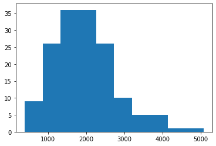
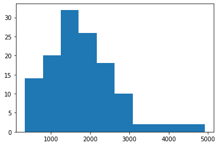

```{r setup, include=FALSE}
knitr::opts_chunk$set(echo = TRUE)
library(SASmarkdown)
```

## Introduction

people who are diagnosed with diabetes are always advised to control their diet and cut calories for their health. But do people in the US literally follow this guideline? 

We found this question very interesting and worth to study. Thus the substantive question our group is going to answer is: Do people diagnosed with diabetes consume less calories in the US?

Our analysis espect to show a Linear Mixed Model(LMM) analyzing the effect of diabetes diagnosis on consumption of total calories, controling over other related predictors. The LMM result can give us information over the calories intake difference among people with and without diabetes.


## Data  

We used the National Health and Nutrition Examination Survey (NHANES) [2015-2016](https://wwwn.cdc.gov/nchs/nhanes/continuousnhanes/default.aspx?BeginYear=2015) data, which is publicly available on Centers for Disease Control and Prevention (CDC) website.   

The datasets and variables we used for our research question are summarized below:  

Dataset | Dataset Description | Variable name | Variable Description | Variable type  
------------- | ------------ | ------------- | ------------| -------------
Every dataset listed below | | SEQN | Respondent<br> sequence number | Numeric  
[**Demographics data**](https://wwwn.cdc.gov/nchs/nhanes/search/datapage.aspx?Component=Demographics&CycleBeginYear=2015) | | | 
DEMO_I | Demographics | RIDAGEYR | Age in years at screening | Numeric 
DEMO_I | Demographics | RIAGENDR | Gender | Numeric 
DEMO_I | Demographics | RIDEXPRG | Pregnancy status at exam | Numeric 
[**Dietary data**](https://wwwn.cdc.gov/nchs/nhanes/search/datapage.aspx?Component=Dietary&CycleBeginYear=2015) | | |
DR1TOT_I | Total Nutrient Intakes<br> First Day | DR1TKCAL | Energy (kcal) | Numeric
DR2TOT_I | Total Nutrient Intakes<br> Second Day |DR2TKCAL | Energy (kcal) | Numeric
[**Examination data**](https://wwwn.cdc.gov/nchs/nhanes/search/datapage.aspx?Component=Examination&CycleBeginYear=2015) | | |
BMI_I | Body Measurement | BMXBMI | Body Mass Index (kg/m$^2$) | Numeric
[**Questionnaire data**](https://wwwn.cdc.gov/nchs/nhanes/Search/DataPage.aspx?Component=Questionnaire&CycleBeginYear=2015) | | |
DIQ_I | Diabetes | DIQ010 | Doctor told you have diabetes | Numeric
PAQ_I | Physical Activity | PAD615 | Minutes vigorous-intensity work | Numeric
PAD_I | Physical Activity | PAD630 | Minutes moderate-intensity work | Numeric
PAD_I | Physical Activity | PAD680 | Minutes sedentary activity | Numeric


## Methods  

We fitted a linear mixed model to analyze the effect of diabetes diagnosis on consumption of total calories from both interview days, controlling for demographics, BMI and physical activity, and including a random intercept for each respondent. Below we provide details in each step: 

1. Data merging  

XPT files needed for the analysis were downloaded from the CDC website. Different datasets were merged into one using SEQN (respondent sequence number), and only variables we listed in the above data section were included in the merged data.  

We have a merged dataset for day 1 only, one for day 2 only, and another one with day 1 and day 2 data stacked together.  

2. Inclusion/exclusion criteria  

Respondents with unknown diabetes are excluded from analysis.  

Respondents with confirmed pregnancy (RIDEXPRG) were excluded from our analysis.  

Ages over 89 are considered protected health infomration (PHI). Therefore, NHANES data top-coded age variable at 80 years old, which means respondents aged 80 or more were all recorded as 80 in NHANES data. Therefore, we only include respondents aged 12 to 79 in our analysis.  

3. Variable recoding  

We created a new binary *diabetes* variable, where respondents with diabetes diagnosis or borderline diagnosis are both considered positive (1)  in this new variable, and respondents with confirmed non-diabetes diagnosis are considered negative (0).  

We recoded the two-level (1 vs 2) gender variable to a new *male* variable, where 1 indicates male, and 0 indicates female.  

We added a *day* variable to indicate the dietary interview day.  

4. Missing pattern checks
Missingness of each variable was checked in our analysis. Variable with large proportion of missing was furthre excluded from our analysis. Observations with missing in any of the variables we are going to use were deleted from the working dataset.  

5. Normality examination  

We checked the normality of our response variable - total energy (kcal), by interview day, and discussed the necessity of transformation.  

6. Multicollinearity inspection  

The correlation matrix of predictors were examined. 

We then fitted a simple linear regression model using day 1 data only, and examined the variance inflation factor (VIF) to assess collinearity.  

Predictors were the selected based on the multicollinearity inspection results.

7. Model fitting  

We used both days' data to then fit a linear mixed model, including a random intercept for each respondent. 

**To do:** obtain marginal effects  


The data preparation, model checking and model fitting were performed parallel in R, SAS, and Python. 


## Core Analysis {.tabset .tabset-fade .tabset-pills}

**To do**:

We will do code review later.  

### R 
```{r setup_r, include=FALSE}
library(foreign)
library(tidyr)
library(plyr)
library(dplyr)
library(corrplot)
library(lme4)
```
Question: Do people diagnosed with diabetes consume less calories in the US?

```{r, warning=FALSE}
DEMO = read.xport("./Data/DEMO_I.XPT")
DIQ = read.xport("./Data/DIQ_I.XPT")
PAQ = read.xport("./Data/PAQ_I.XPT")
DR1 = read.xport("./Data/DR1TOT_I.XPT")
DR2 = read.xport("./Data/DR2TOT_I.XPT")
BMX = read.xport("./Data/BMX_I.XPT")
```

Variables of interest:

| Dataset | Variable Name | Variable Description            | Notes on variable use            |
|:------- |:------------- |:------------------------------- |:-------------------------------- |
| (ALL)   | SEQN          | Respondent sequence number      | For merging purpose              |
| DEMO    | RIDAGEYR      | Age in years at screening       | Top-coded at 80 and above,       |
|         |               |                                 | convert to age groups            |
|         | RIAGENDR      | Gender                          |                                  |
|         | RIDEXPRG      | Pregnancy status at exam        | Exclude pregnant participants    |
| DIQ     | DIQ010        | Doctor told you have diabetes   | Binary                           |
| PAQ     | PAD615        | Vigorous-intensity work (min)   |                                  |
|         | PAD630        | Moderate-intensity work (min)   |                                  |
|         | PAD680        | Sedentary activity (min)        |                                  |
| DR1     | DR1TKCAL      | Energy (kcal)                   | Response variable                |
| DR2     | DR2TKCAL      | Energy (kcal)                   | Response variable                |
| BMX     | BMXBMI        | Body Mass Index (kg/m**2)       |                                  |

```{r, warning=FALSE}
# Merge all of the relevant variables
dm = join_all(list(DEMO[,c("SEQN", "RIDAGEYR", "RIAGENDR", "RIDEXPRG")],
                   DIQ[,c("SEQN", "DIQ010")],
                   PAQ[,c("SEQN", "PAD615", "PAD630", "PAD680")],
                   DR1[,c("SEQN", "DR1TKCAL")],
                   DR2[,c("SEQN", "DR2TKCAL")],
                   BMX[,c("SEQN", "BMXBMI")]),
              by = "SEQN")
names(dm) = c("SEQN","age","gender","pregnancy","DIQ010",
              "vig_work","mod_work","sed_act","DR1","DR2","bmi")
```

```{r, warning=FALSE}
# create a "not in" operator
`%notin%` = Negate(`%in%`)

# exclude data without diabetes diagnosis
c = c(1,2,3)
dm = dm[-which(dm$DIQ010 %notin% c), ]

# exclude pregnant participants
dm = dm[-which(dm$pregnancy==1), ]

# create a new variable representing diabetes
  # 1 - diabetes or borderline
  # 0 - non-diabetes
dm$diabetes = ifelse(dm$DIQ010==2, 0, 1)

# create a new variable representing male
  # 1 - male
  # 0 - female
dm$male = ifelse(dm$gender==1, 1, 0)

# pivot the data into "long" format
# and create a variable representing dietary interview day (1/2)
dm = dm %>%
  pivot_longer(
    cols = starts_with("DR"),
    names_to = "day",
    names_prefix = "DR",
    values_to = "kcal",
    values_drop_na = FALSE
    )%>%
  arrange(SEQN, day)

# check for missing values for each variable
colSums(is.na(dm))
```

```
`vig_work` and `mod_work` have much more missing values than other variables, so it is
reasonable to remove them from the data frame.  
`pregnancy` can also be removed since we only need this variable to filter out pregnant
individuals.  
`DIQ010` and `gender` are now redundant due to the new variables.  

Note that `age` is top-coded at 80, which means participants aged 80 or older were all
recorded as age 80. To avoid inaccurate data, we decided to set an age bound from 12 to 79.
```

```{r, warning=FALSE}
dm = dm %>%
  select(-pregnancy, -vig_work, -mod_work, -DIQ010, -gender) %>%
  filter(age>=12 & age<=79)
dm$day = as.numeric(dm$day)
# remove rows with missing value
dm_final = dm[complete.cases(dm),]
dr1_final = dm_final[dm_final$day==1,]
dr2_final = dm_final[dm_final$day==2,]
```

```{r, warning=FALSE}
# check if the response variable - kcal is normally distributed
# day1
hist(dm_final[dm_final$day==1, ]$kcal, main = "Day 1")
# day2
hist(dm_final[dm_final$day==2, ]$kcal, main = "Day 2")
```

```
`kcal` seems to be approximately normal with a longer right tail for both day1 and day2.
In this case, no transformation would be needed.
```

```{r, warning=FALSE}
# fit a linear regression model
model = dm_final %>% lm(formula = kcal ~ age + sed_act + bmi + diabetes + male)
# check collinearity
summary(model)
faraway::vif(model)
corrplot(cor(dm_final))
corrplot(cor(dr1_final))
```

```
No collinearity found.
```

```{r, warning=FALSE}
# fit a linear mixed model
model2 = dm_final %>% lmer(formula = kcal ~ age + sed_act + bmi + diabetes + male + (1|SEQN))
summary(model2)
```

### SAS 
```{r, echo = FALSE}
cat("```SAS\n")
writeLines(readLines("./SAS/dm_cal_lmm.sas"))
cat("```")
```


### Python 
```python
# Stats 506, Fall 2019
# Group Project - Group 3
#
# This script analyzes the question:
# "Do people diagnosed with diabetes consume less calories in US?"
#
# NHANES 2015-2016 data are used in this problem.
#
#
# import packages
import pandas as pd
from dfply import *
from scipy import stats
import statsmodels.api as sm
import statsmodels.formula.api as smf
import matplotlib.pyplot as plt
from patsy import dmatrices
from statsmodels.stats.outliers_influence import variance_inflation_factor
```

    C:\Users\wenji\AppData\Local\Continuum\anaconda3\lib\site-packages\statsmodels\compat\pandas.py:23: FutureWarning: The Panel class is removed from pandas. Accessing it from the top-level namespace will also be removed in the next version
      data_klasses = (pandas.Series, pandas.DataFrame, pandas.Panel)


```python
# read data
demo = pd.read_sas('DEMO_I.XPT')
dr1tot = pd.read_sas('DR1TOT_I.XPT')
dr2tot = pd.read_sas('DR2TOT_I.XPT')
bmx = pd.read_sas('BMX_I.XPT')
diq = pd.read_sas('DIQ_I.XPT')
pad = pd.read_sas('PAQ_I.XPT')
```


```python
# select columns and merge into a single dataset
demo_new = (demo >> 
            select(X.SEQN, X.RIDAGEYR, X.RIAGENDR, X.RIDEXPRG))
dr1tot_new = (dr1tot >>
              mutate(dr1 = X.DR1TKCAL) >>
              select(X.SEQN, X.dr1))
dr2tot_new = (dr2tot >>
              mutate(dr2 = X.DR2TKCAL) >>
             select(X.SEQN, X.dr2))
dietary = pd.merge(dr1tot_new, dr2tot_new, on='SEQN')
bmx_new = (bmx >>
          select(X.SEQN, X.BMXBMI))
diq_new = (diq >>
          select(X.SEQN, X.DIQ010))
pad_new = (pad >>
          select(X.SEQN, X.PAD615, X.PAD630, X.PAD680))
questionnaire = pd.merge(diq_new, pad_new, on='SEQN')
merge_2 = pd.merge(bmx_new, questionnaire, on='SEQN')
merge_3 = pd.merge(merge_2, demo_new, on='SEQN')

# exclude data without diabetes diagnosis
merge_3 = merge_3[merge_3.DIQ010 != 7 ]
merge_3 = merge_3[merge_3.DIQ010 != 9 ]

# exclude pregnant participants
merge_3 = merge_3[merge_3.RIDEXPRG != 1 ]

# create a new variable representing diabetes
  # 1 - diabetes or borderline
  # 0 - non-diabetes
diabete = []
for i in merge_3.DIQ010:
    if i == 2:
        diabete.append(0)
    else:
        diabete.append(1)
merge_3['diabetes'] = diabete

# create a new variable representing male
  # 1 - male
  # 0 - female
gender = []
for i in merge_3.RIAGENDR:
    if i == 1:
        gender.append(1)
    else:
        gender.append(0)
merge_3['gender'] = gender
merge = pd.merge(merge_3, dietary, on='SEQN')

# pivot the data into "long" format
merge = merge.melt(id_vars=merge.iloc[:,0:11], var_name='day', value_name='y')

# create a variable representing dietary interview day (1/2)
days = []
for i in merge.day:
    if i == 'dr1':
        days.append(1)
    else:
        days.append(2)
merge['day'] = days

# remove rows with missing value
merge = merge.dropna()

# Note that `age` is top-coded at 80, 
## which means participants aged 80 or older were allrecorded as age 80. 
## To avoid inaccurate data, we decided to set an age bound from 12 to 79.
merge = merge[merge["RIDAGEYR"] < 80]
merge = merge[merge["RIDAGEYR"] > 12]

# remove rows with missing value
final = merge.drop(["RIDEXPRG", "PAD615", "PAD630", "DIQ010", "RIAGENDR"], axis=1)
final_day1 = final[final["day"] == 1]
final_day2 = final[final["day"] == 2]
```


```python
# check linearity for final_day1
plt.hist(final_day1["y"])
plt.show()
```





```python
# check linearity for final_day1
plt.hist(final_day2["y"])
plt.show()
```





```python
k2, p = stats.normaltest(final_day1['y'])
print("p = {:g}".format(p))
```

    p = 0.000159355


```python
k2, p = stats.normaltest(final_day2['y'])
print("p = {:g}".format(p))
```

    p = 5.06948e-06


No non-linearity found.


```python
# OLS model for day 1
x = sm.add_constant(final_day1[final_day1.columns[1:5]])
model = sm.OLS(final_day1['y'], x)
results = model.fit()
print(results.summary())
```

                                OLS Regression Results                            
    ==============================================================================
    Dep. Variable:                      y   R-squared:                       0.004
    Model:                            OLS   Adj. R-squared:                 -0.022
    Method:                 Least Squares   F-statistic:                    0.1695
    Date:                Tue, 03 Dec 2019   Prob (F-statistic):              0.954
    Time:                        23:37:40   Log-Likelihood:                -1260.1
    No. Observations:                 155   AIC:                             2530.
    Df Residuals:                     150   BIC:                             2545.
    Df Model:                           4                                         
    Covariance Type:            nonrobust                                         
    ==============================================================================
                     coef    std err          t      P>|t|      [0.025      0.975]
    ------------------------------------------------------------------------------
    const       2047.3486    420.058      4.874      0.000    1217.353    2877.344
    BMXBMI        -3.5250      7.775     -0.453      0.651     -18.887      11.837
    PAD680        -0.0501      0.417     -0.120      0.905      -0.874       0.774
    RIDAGEYR       0.6708     10.121      0.066      0.947     -19.327      20.668
    diabetes     265.4636    354.898      0.748      0.456    -435.781     966.708
    ==============================================================================
    Omnibus:                       17.668   Durbin-Watson:                   2.023
    Prob(Omnibus):                  0.000   Jarque-Bera (JB):               20.567
    Skew:                           0.767   Prob(JB):                     3.42e-05
    Kurtosis:                       3.912   Cond. No.                     2.20e+03
    ==============================================================================
    
    Warnings:
    [1] Standard Errors assume that the covariance matrix of the errors is correctly specified.
    [2] The condition number is large, 2.2e+03. This might indicate that there are
    strong multicollinearity or other numerical problems.


```python
# Break into left and right hand side; y and X
y, X = dmatrices("y ~ BMXBMI + PAD680 + RIDAGEYR + diabetes", data=final_day1, return_type="dataframe")

# For each Xi, calculate VIF
vif = [variance_inflation_factor(X.values, i) for i in range(X.shape[1])]
vif
```


    [39.24402833965102,
     1.032095249588678,
     1.0253815257501617,
     1.0158300005008685,
     1.0424003078079123]


No collinearity found.


```python
# LMM model
mixed = smf.mixedlm("y ~ BMXBMI + PAD680 + RIDAGEYR + diabetes", final, groups = final["SEQN"])
mixed_fit = mixed.fit()
#print the summary
print(mixed_fit.summary())
```

               Mixed Linear Model Regression Results
    ============================================================
    Model:             MixedLM  Dependent Variable:  y          
    No. Observations:  283      Method:              REML       
    No. Groups:        155      Scale:               429378.5852
    Min. group size:   1        Likelihood:          -2278.9563 
    Max. group size:   2        Converged:           Yes        
    Mean group size:   1.8                                      
    ------------------------------------------------------------
                Coef.    Std.Err.   z    P>|z|  [0.025   0.975] 
    ------------------------------------------------------------
    Intercept   1805.051  365.610  4.937 0.000 1088.468 2521.633
    BMXBMI        -2.985    6.857 -0.435 0.663  -16.424   10.454
    PAD680         0.047    0.367  0.129 0.898   -0.672    0.767
    RIDAGEYR       4.738    8.810  0.538 0.591  -12.529   22.006
    diabetes     357.817  311.786  1.148 0.251 -253.273  968.906
    Group Var 293000.409  135.495                               
    ============================================================
    


```python
mixed_fit.random_effects
```


    {83752.0: Group    714.014326
     dtype: float64, 83781.0: Group    218.054765
     dtype: float64, 83857.0: Group    136.60615
     dtype: float64, 83959.0: Group   -550.314443
     dtype: float64, 84033.0: Group   -79.760159
     dtype: float64, 84073.0: Group    562.812273
     dtype: float64, 84130.0: Group   -355.544879
     dtype: float64, 84187.0: Group   -210.096806
     dtype: float64, 84192.0: Group   -344.604582
     dtype: float64, 84412.0: Group    8.118748
     dtype: float64, 84440.0: Group   -381.40279
     dtype: float64, 84547.0: Group   -155.45698
     dtype: float64, 84587.0: Group    194.945027
     dtype: float64, 84716.0: Group    96.785213
     dtype: float64, 84766.0: Group   -152.005506
     dtype: float64, 84797.0: Group    1511.578945
     dtype: float64, 84816.0: Group   -0.664801
     dtype: float64, 84825.0: Group    89.080769
     dtype: float64, 84937.0: Group    161.108954
     dtype: float64, 85040.0: Group   -93.508833
     dtype: float64, 85055.0: Group    349.567852
     dtype: float64, 85132.0: Group   -305.468962
     dtype: float64, 85160.0: Group    39.245748
     dtype: float64, 85222.0: Group    236.712323
     dtype: float64, 85309.0: Group    248.162962
     dtype: float64, 85343.0: Group   -509.875522
     dtype: float64, 85515.0: Group   -469.712628
     dtype: float64, 85659.0: Group    1138.40668
     dtype: float64, 85676.0: Group    678.179722
     dtype: float64, 85696.0: Group   -717.05304
     dtype: float64, 85787.0: Group    575.344502
     dtype: float64, 85915.0: Group   -583.993194
     dtype: float64, 85936.0: Group   -492.497505
     dtype: float64, 85948.0: Group   -167.173206
     dtype: float64, 86022.0: Group   -264.348461
     dtype: float64, 86029.0: Group   -54.685422
     dtype: float64, 86189.0: Group    683.036407
     dtype: float64, 86262.0: Group    278.254524
     dtype: float64, 86322.0: Group   -204.938091
     dtype: float64, 86461.0: Group    312.717254
     dtype: float64, 86490.0: Group   -377.055662
     dtype: float64, 86528.0: Group   -345.910279
     dtype: float64, 86600.0: Group    156.838753
     dtype: float64, 86611.0: Group   -81.519336
     dtype: float64, 86632.0: Group    636.09565
     dtype: float64, 86761.0: Group    13.277571
     dtype: float64, 86968.0: Group    44.50787
     dtype: float64, 86981.0: Group   -30.553453
     dtype: float64, 87005.0: Group    176.754849
     dtype: float64, 87046.0: Group    197.183121
     dtype: float64, 87066.0: Group    718.380519
     dtype: float64, 87130.0: Group    262.78048
     dtype: float64, 87171.0: Group   -365.31923
     dtype: float64, 87200.0: Group    311.313816
     dtype: float64, 87243.0: Group   -359.342715
     dtype: float64, 87346.0: Group   -572.494736
     dtype: float64, 87423.0: Group   -550.337855
     dtype: float64, 87427.0: Group    107.663298
     dtype: float64, 87473.0: Group   -44.58847
     dtype: float64, 87501.0: Group    414.740938
     dtype: float64, 87520.0: Group   -73.164355
     dtype: float64, 87636.0: Group   -194.083515
     dtype: float64, 87802.0: Group   -92.607756
     dtype: float64, 87808.0: Group   -146.476724
     dtype: float64, 87845.0: Group   -373.510281
     dtype: float64, 87892.0: Group    489.839415
     dtype: float64, 87895.0: Group   -390.494126
     dtype: float64, 87942.0: Group   -392.209017
     dtype: float64, 88072.0: Group   -394.701329
     dtype: float64, 88082.0: Group    336.74161
     dtype: float64, 88147.0: Group   -416.693601
     dtype: float64, 88205.0: Group   -64.438246
     dtype: float64, 88333.0: Group   -181.612475
     dtype: float64, 88412.0: Group    381.73585
     dtype: float64, 88440.0: Group    389.22565
     dtype: float64, 88451.0: Group    339.779095
     dtype: float64, 88504.0: Group    442.186858
     dtype: float64, 88507.0: Group   -673.367181
     dtype: float64, 88540.0: Group    605.596895
     dtype: float64, 88570.0: Group   -403.536666
     dtype: float64, 88583.0: Group   -438.528456
     dtype: float64, 88632.0: Group    75.008079
     dtype: float64, 88674.0: Group   -586.50933
     dtype: float64, 88707.0: Group   -558.201297
     dtype: float64, 88720.0: Group    87.970199
     dtype: float64, 88786.0: Group   -249.136366
     dtype: float64, 88868.0: Group    281.690192
     dtype: float64, 88892.0: Group   -88.3253
     dtype: float64, 88970.0: Group   -47.402054
     dtype: float64, 89160.0: Group   -448.346747
     dtype: float64, 89233.0: Group    42.706284
     dtype: float64, 89362.0: Group    348.886368
     dtype: float64, 89453.0: Group   -31.18674
     dtype: float64, 89474.0: Group   -336.343452
     dtype: float64, 89659.0: Group   -83.884884
     dtype: float64, 89823.0: Group   -347.228356
     dtype: float64, 89833.0: Group   -237.332797
     dtype: float64, 89854.0: Group    561.270842
     dtype: float64, 89929.0: Group   -133.058818
     dtype: float64, 89980.0: Group    310.033335
     dtype: float64, 90020.0: Group    404.522018
     dtype: float64, 90074.0: Group   -58.219194
     dtype: float64, 90189.0: Group   -97.953465
     dtype: float64, 90398.0: Group   -164.116793
     dtype: float64, 90461.0: Group   -34.15224
     dtype: float64, 90463.0: Group   -5.077516
     dtype: float64, 90494.0: Group   -114.910465
     dtype: float64, 90516.0: Group    384.055122
     dtype: float64, 90547.0: Group   -568.2198
     dtype: float64, 90573.0: Group    488.537931
     dtype: float64, 90627.0: Group   -753.197529
     dtype: float64, 90804.0: Group    321.643389
     dtype: float64, 90966.0: Group    219.392462
     dtype: float64, 90994.0: Group   -60.076761
     dtype: float64, 91078.0: Group   -670.218994
     dtype: float64, 91091.0: Group    82.73983
     dtype: float64, 91101.0: Group    107.132758
     dtype: float64, 91113.0: Group    1000.538565
     dtype: float64, 91139.0: Group    276.856001
     dtype: float64, 91204.0: Group    532.575261
     dtype: float64, 91249.0: Group   -192.087851
     dtype: float64, 91324.0: Group    99.021472
     dtype: float64, 91336.0: Group   -235.33189
     dtype: float64, 91358.0: Group   -175.056167
     dtype: float64, 91724.0: Group   -495.84074
     dtype: float64, 91826.0: Group    556.551694
     dtype: float64, 91835.0: Group   -332.41481
     dtype: float64, 91893.0: Group   -443.260514
     dtype: float64, 91916.0: Group   -578.614068
     dtype: float64, 91922.0: Group   -135.215927
     dtype: float64, 91993.0: Group    382.422285
     dtype: float64, 91997.0: Group   -88.97439
     dtype: float64, 91999.0: Group    284.130785
     dtype: float64, 92190.0: Group   -561.968772
     dtype: float64, 92225.0: Group    141.469799
     dtype: float64, 92300.0: Group   -182.623942
     dtype: float64, 92423.0: Group    216.453842
     dtype: float64, 92428.0: Group    686.550434
     dtype: float64, 92478.0: Group    216.045579
     dtype: float64, 92506.0: Group   -630.770357
     dtype: float64, 92545.0: Group   -96.402139
     dtype: float64, 92551.0: Group    640.640992
     dtype: float64, 92657.0: Group    19.039244
     dtype: float64, 92761.0: Group   -73.781813
     dtype: float64, 92767.0: Group    64.327762
     dtype: float64, 93123.0: Group    414.336505
     dtype: float64, 93213.0: Group   -162.775118
     dtype: float64, 93222.0: Group    212.973539
     dtype: float64, 93305.0: Group   -2.255547
     dtype: float64, 93392.0: Group   -269.232823
     dtype: float64, 93483.0: Group    422.638117
     dtype: float64, 93524.0: Group    257.480725
     dtype: float64, 93600.0: Group   -258.58231
     dtype: float64, 93606.0: Group   -511.249068
     dtype: float64, 93665.0: Group   -241.828374
     dtype: float64}


## Additional Analysis  

**To do**: 
Tables? Figures? 


## Results  

**To do**: 

What is the answer to your question?  

What did you learn about the data?  

## Discussion  
