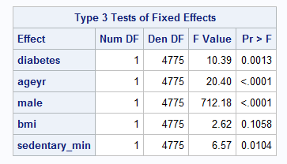

```{r setup, include=FALSE}
knitr::opts_chunk$set(echo = TRUE)
```

## Introduction

People who are diagnosed with diabetes are generally advised to control their diet and cut calories for their health (**To do**: insert a reference here). Do people in the US literally follow this guideline? 

We found this question very interesting and worth to study. Thus the substantive question our group is going to answer is: Do people diagnosed with diabetes consume less calories in the US?

Our analysis plan is to use a Linear Mixed Model(LMM) analyzing the effect of diabetes diagnosis on consumption of total calories, controling over other related predictors. The LMM result can give us information over the calories intake difference among people with and without diabetes.


## Data  

We used the National Health and Nutrition Examination Survey (NHANES) [2015-2016](https://wwwn.cdc.gov/nchs/nhanes/continuousnhanes/default.aspx?BeginYear=2015) data, which is publicly available on Centers for Disease Control and Prevention (CDC) website.   

The datasets and variables we used for our research question are summarized below:  

Dataset | Dataset Description | Variable name | Variable Description | Variable type  
------------- | ------------ | ------------- | ------------| -------------
Every dataset listed below | | SEQN | Respondent<br> sequence number | Numeric  
[**Demographics data**](https://wwwn.cdc.gov/nchs/nhanes/search/datapage.aspx?Component=Demographics&CycleBeginYear=2015) | | | 
DEMO_I | Demographics | RIDAGEYR | Age in years at screening | Numeric 
DEMO_I | Demographics | RIAGENDR | Gender | Numeric 
DEMO_I | Demographics | RIDEXPRG | Pregnancy status at exam | Numeric 
[**Dietary data**](https://wwwn.cdc.gov/nchs/nhanes/search/datapage.aspx?Component=Dietary&CycleBeginYear=2015) | | |
DR1TOT_I | Total Nutrient Intakes<br> First Day | DR1TKCAL | Energy (kcal) | Numeric
DR2TOT_I | Total Nutrient Intakes<br> Second Day |DR2TKCAL | Energy (kcal) | Numeric
[**Examination data**](https://wwwn.cdc.gov/nchs/nhanes/search/datapage.aspx?Component=Examination&CycleBeginYear=2015) | | |
BMI_I | Body Measurement | BMXBMI | Body Mass Index (kg/m$^2$) | Numeric
[**Questionnaire data**](https://wwwn.cdc.gov/nchs/nhanes/Search/DataPage.aspx?Component=Questionnaire&CycleBeginYear=2015) | | |
DIQ_I | Diabetes | DIQ010 | Doctor told you have diabetes | Numeric
PAQ_I | Physical Activity | PAD615 | Minutes vigorous-intensity work | Numeric
PAD_I | Physical Activity | PAD630 | Minutes moderate-intensity work | Numeric
PAD_I | Physical Activity | PAD680 | Minutes sedentary activity | Numeric


## Methods  

We fitted a linear mixed model to analyze the effect of diabetes diagnosis on consumption of total calories from both interview days, controlling for demographics, BMI and physical activity, and including a random intercept for each respondent. Below we provide details in each step: 

1. Data merging  

XPT files needed for the analysis were downloaded from the CDC website. Different datasets were merged into one using SEQN (respondent sequence number), and only variables we listed in the above data section were included in the merged data.  

We have a merged dataset for day 1 only, one for day 2 only, and another one with day 1 and day 2 data stacked together.  

2. Inclusion/exclusion criteria  

Respondents with unknown diabetes are excluded from analysis.  

Respondents with confirmed pregnancy (RIDEXPRG) were excluded from our analysis.  

Ages over 89 are considered protected health infomration (PHI). Therefore, NHANES data top-coded age variable at 80 years old, which means respondents aged 80 or more were all recorded as 80 in NHANES data. Therefore, we only include adolescent and adult respondents aged 12 to 79 in our analysis.  

3. Variable recoding  

We created a new binary *diabetes* variable, where respondents with diabetes diagnosis or borderline diagnosis are both considered positive (1)  in this new variable, and respondents with confirmed non-diabetes diagnosis are considered negative (0).  

We recoded the two-level (1 vs 2) gender variable to a new *male* variable, where 1 indicates male, and 0 indicates female.  

We added a *day* variable to indicate the dietary interview day.  

4. Missing pattern checks
Missingness of each variable was checked in our analysis. Variable with large proportion of missing was furthre excluded from our analysis. Observations with missing in any of the variables we are going to use were deleted from the working dataset.  

5. Normality examination  

We checked the normality of our response variable - total energy (kcal), by interview day, and discussed the necessity of transformation.  

6. Multicollinearity inspection  

The correlation matrix of predictors were examined. 

We then fitted a simple linear regression model using day 1 data only, and examined the variance inflation factor (VIF) to assess collinearity.  

Predictors were the selected based on the multicollinearity inspection results.

7. Model fitting  

We used both days' data to then fit a linear mixed model, including a random intercept for each respondent. 

**To do:** obtain marginal effects  


The data preparation, model checking and model fitting were performed parallel in R, SAS, and Python. 

## Core Analysis {.tabset .tabset-fade .tabset-pills}

### R 
```{r setup_r, include=FALSE}
## Group project - R
##
## Question: Do people diagnosed with diabetes consume less calories in the US?
##
## Author: Bei An (anbei@umich.edu)
## Updated: Dec 10, 2019
# 80: -------------------------------------------------------------------------

# set up
library(foreign)
library(tidyr)
library(plyr)
library(dplyr)
library(corrplot)
library(lme4)
library(ggplot2)
```
**Question: Do people diagnosed with diabetes consume less calories in the US?**

```{r, warning=FALSE}
DEMO = read.xport("./Data/DEMO_I.XPT")
DIQ = read.xport("./Data/DIQ_I.XPT")
PAQ = read.xport("./Data/PAQ_I.XPT")
DR1 = read.xport("./Data/DR1TOT_I.XPT")
DR2 = read.xport("./Data/DR2TOT_I.XPT")
BMX = read.xport("./Data/BMX_I.XPT")
```

Variables of interest:

| Dataset | Variable Name | Variable Description            | Notes on variable use            |
|:------- |:------------- |:------------------------------- |:-------------------------------- |
| (ALL)   | SEQN          | Respondent sequence number      | For merging purpose              |
| DEMO    | RIDAGEYR      | Age in years at screening       | Top-coded at 80 and above,       |
|         |               |                                 | convert to age groups            |
|         | RIAGENDR      | Gender                          |                                  |
|         | RIDEXPRG      | Pregnancy status at exam        | Exclude pregnant participants    |
| DIQ     | DIQ010        | Doctor told you have diabetes   | Binary                           |
| PAQ     | PAD615        | Vigorous-intensity work (min)   |                                  |
|         | PAD630        | Moderate-intensity work (min)   |                                  |
|         | PAD680        | Sedentary activity (min)        |                                  |
| DR1     | DR1TKCAL      | Energy (kcal)                   | Response variable                |
| DR2     | DR2TKCAL      | Energy (kcal)                   | Response variable                |
| BMX     | BMXBMI        | Body Mass Index (kg/m**2)       |                                  |

```{r, warning=FALSE}
# Merge all of the relevant variables
dm = join_all(list(DEMO[,c("SEQN", "RIDAGEYR", "RIAGENDR", "RIDEXPRG")],
                   DIQ[,c("SEQN", "DIQ010")],
                   PAQ[,c("SEQN", "PAD615", "PAD630", "PAD680")],
                   DR1[,c("SEQN", "DR1TKCAL")],
                   DR2[,c("SEQN", "DR2TKCAL")],
                   BMX[,c("SEQN", "BMXBMI")]),
              by = "SEQN")
names(dm) = c("SEQN","age","gender","pregnancy","DIQ010",
              "vig_work","mod_work","sed_act","DR1","DR2","bmi")
```

```{r, warning=FALSE}
# create a "not in" operator
`%notin%` = Negate(`%in%`)

# exclude data without diabetes diagnosis
c = c(1,2,3)
dm = dm[-which(dm$DIQ010 %notin% c), ]

# exclude pregnant participants
dm = dm[-which(dm$pregnancy==1), ]

# create a new variable representing diabetes
  # 1 - diabetes or borderline
  # 0 - non-diabetes
dm$diabetes = ifelse(dm$DIQ010==2, 0, 1)

# create a new variable representing male
  # 1 - male
  # 0 - female
dm$male = ifelse(dm$gender==1, 1, 0)

# pivot the data into "long" format
# and create a variable representing dietary interview day (1/2)
dm = dm %>%
  pivot_longer(
    cols = starts_with("DR"),
    names_to = "day",
    names_prefix = "DR",
    values_to = "kcal",
    values_drop_na = FALSE
    )%>%
  arrange(SEQN, day)

# check for missing values for each variable
colSums(is.na(dm))
```

```
`vig_work` and `mod_work` have much more missing values than other variables, so it is
reasonable to remove them from the data frame.  
`pregnancy` can also be removed since we only need this variable to filter out pregnant
individuals.  
`DIQ010` and `gender` are now redundant due to the new variables.  

Note that `age` is top-coded at 80, which means participants aged 80 or older were all
recorded as age 80. To avoid inaccurate data, we decided to set an age bound from 12 to 79.
```

```{r, warning=FALSE}
dm = dm %>%
  select(-pregnancy, -vig_work, -mod_work, -DIQ010, -gender) %>%
  filter(age>=12 & age<=79)
dm$day = as.numeric(dm$day)
# remove rows with missing value
dm_final = dm[complete.cases(dm),]
dr1_final = dm_final[dm_final$day==1,]
dr2_final = dm_final[dm_final$day==2,]
```

```{r, warning=FALSE}
# check if the response variable - kcal is normally distributed
# day1
ggplot(dr1_final, aes(x = kcal)) + 
  geom_histogram(aes(y = ..density..), 
                 bins = 100, 
                 fill = "blue", 
                 alpha = 0.8) + 
  stat_function(fun = dnorm, 
                args = list(mean = mean(dr1_final$kcal), 
                            sd = sd(dr1_final$kcal))) + 
  labs(x = "Total Energy (kcal)", y = "Frequency") + 
  theme_bw()
# day2
ggplot(dr2_final, aes(x = kcal)) + 
  geom_histogram(aes(y = ..density..), 
                 bins = 100, 
                 fill = "blue", 
                 alpha = 0.8) + 
  stat_function(fun = dnorm, 
                args = list(mean = mean(dr2_final$kcal), 
                            sd = sd(dr2_final$kcal))) + 
  labs(x = "Total Energy (kcal)", y = "Frequency") + 
  theme_bw()
```

```
`kcal` seems to be approximately normal with a longer right tail for both day1 and day2.
In this case, no transformation would be needed.
```

```{r, warning=FALSE}
# fit a linear regression model
model = dr1_final %>% 
  lm(formula = kcal ~ age + sed_act + bmi + factor(diabetes) + factor(male))
# check collinearity
summary(model)
faraway::vif(model)
corrplot(cor(dr1_final))
```

```
No collinearity found.
```

```{r, warning=FALSE}
# fit a linear mixed model
model2 = dm_final %>% 
  lmer(formula = kcal ~ age + sed_act + bmi + factor(diabetes) + factor(male) + (1|SEQN))
summary(model2)
```


### SAS 
```sas
/******************************************************************************/
* Stats 506, Fall 2019														   ;
* Group Project - Group 3													   ;
*------------------------------------------------------------------------------;
* This script analyzes the question:										   ;
* 	"Do people diagnosed with diabetes consume less calories in US?"		   ;
* NHANES 2015-2016 data are used in this problem. 							   ;
* The script has following parts to complete the task:						   ;
* A. Merge source data														   ;
* 	 Merge information from:												   ;
*		Demographics - subject ID, age, gender								   ;
*		Dietary - subject ID, total calories (day 1), total calories (day 2)   ;
*		Examination - subject ID, BMI										   ;
*	    Questionnaire - subject ID, diabetes, pregnancy						   ;
*					  - vigorous/moderate/sedentary activity minutes		   ;
* B. Check missing patterns													   ;
*	 Check missing patterns of all variables								   ;
*	 Take a closer look at three physical activity variables				   ; 
* C. Handle top-coded age													   ;
*	 NHANES data top-coded age at 80 and above. 							   ;
*	 Choose a method to handle it appropriately.							   ;
* D. Transformation of response variable									   ;
*	 Examine the normality of response variable								   ;
*	 Determine whether a transformation is needed							   ;
* E. Initial model to examine collinearity - use Day 1 only					   ;
*	 Use day 1 data only to fit a linear regressio model					   ;
*	 Determine if multicollinearity issue exists							   ;
*	 If yes, handle if appropriately										   ;
* F. Linear mixed model to account for both day 1 and day 2					   ;
*	 Fit a linear mixed model to include both days data						   ;
*	 Include a random intercept for each subject							   ;
*------------------------------------------------------------------------------;
* Author: Jie Cao (caojie@umich.edu)										   ;
* Last updated on: Dec 3, 2019												   ;
/******************************************************************************/


* 80: -------------------------------------------------------------------------;


/* Data directory ----------------------------------------------------------- */
* List of XPT data downloaded from 2015 - 2016 NHANES;
libname DEMO xport "M:\506\data\XPT\DEMO_I.XPT"; 
libname DIQ xport "M:\506\data\XPT\DIQ_I.XPT";
libname PAQ xport "M:\506\data\XPT\PAQ_I.XPT";
libname DR1 xport "M:\506\data\XPT\DR1TOT_I.XPT";
libname DR2 xport "M:\506\data\XPT\DR2TOT_I.XPT";
libname BMX xport "M:\506\data\XPT\BMX_I.XPT";

* Directory to save datasets extracted from XPT files; 
libname NH "M:\506\data\SAS"; 


/* Extract XPT files and save as SAS datasets ------------------------------- */
proc copy in = DEMO out = NH;
run;
proc copy in = DIQ out = NH;
run;
proc copy in = PAQ out = NH;
run;
proc copy in = DR1 out = NH;
run;
proc copy in = DR2 out = NH;
run;
proc copy in = BMX out = NH;
run;


/* Formats ------------------------------------------------------------------- */
proc format;
	/* A format to flag numeric varibles with missing status */
	value missfmt 
		. = "Missing" 
		other = "Non-missing";
	/* Gender format */
	value male
		0 = "Female"
		1 = "Male";
run;
```


```sas
/* Prepare working data ------------------------------------------------------ */

***************************;
* A. Merge source data     ;
****************************

* Dietary day 1 interview plus needed variables;
proc sql;
	create table dr1 as
	select dm.SEQN as subject,
		   1 as day,   
			(case 
			 /* DIQ010 = 2: doctor confirmed no diabetes */ 
			 when dm.DIQ010 = 2 then 0 
			 /* DIQ010 = 1 or 3: doctor confirmed diabetes (1) or borderline (3) */
			 else 1
			 end) as diabetes, 
		   demo.RIDAGEYR as ageyr , 
			(case
			 when demo.RIAGENDR = 1 then 1 
			 when demo.RIAGENDR = 2 then 0 
			 else .
			 end) as male format male., 
		   bm.BMXBMI as bmi, 
		   pa.PAD615 as vigorous_min, 
		   pa.PAD630 as moderate_min, 
		   pa.PAD680 as sedentary_min, 
		   dr1.DR1TKCAL as tot_cal
		    
	from NH.Diq_i dm 
	left join NH.Demo_i demo on dm.SEQN = demo.SEQN
	left join NH.Bmx_i bm on dm.SEQN = bm.SEQN
	left join NH.Paq_i pa on dm.SEQN = pa.SEQN
	left join NH.Dr1tot_i dr1 on dm.SEQN = dr1.SEQN
	
	/* Include subjects with known answers to diabete diagnosis &
	   exclude participants confirmed with pregnancy */
	where dm.DIQ010 in (1, 2, 3) and demo.RIDEXPRG NE 1;
quit;
```

NOTE: Table WORK.DR1 created, with 9501 rows and 10 columns.

```sas
* Dietary day 2 interview plus needed variables; 
proc sql;
	create table dr2 as
	select dm.SEQN as subject,
		   2 as day,   
			(case 
			 /* DIQ010 = 2: doctor confirmed no diabetes */ 
			 when dm.DIQ010 = 2 then 0 
			 /* DIQ010 = 1 or 3: doctor confirmed diabetes (1) or borderline (3) */
			 else 1
			 end) as diabetes, 
		   demo.RIDAGEYR as ageyr,  
			(case
			 when demo.RIAGENDR = 1 then 1 
			 when demo.RIAGENDR = 2 then 0 
			 else .
			 end) as male format male.,  
		   bm.BMXBMI as bmi, 
		   pa.PAD615 as vigorous_min, 
		   pa.PAD630 as moderate_min, 
		   pa.PAD680 as sedentary_min, 
		   dr2.DR2TKCAL as tot_cal
		    
	from NH.Diq_i dm 
	left join NH.Demo_i demo on dm.SEQN = demo.SEQN
	left join NH.Bmx_i bm on dm.SEQN = bm.SEQN
	left join NH.Paq_i pa on dm.SEQN = pa.SEQN
	left join NH.Dr2tot_i dr2 on dm.SEQN = dr2.SEQN

	/* Include subjects with known answers to diabete diagnosis &
	   exclude participants confirmed with pregnancy */
	where dm.DIQ010 in (1, 2, 3) and demo.RIDEXPRG NE 1;
quit;
```

NOTE: Table WORK.DR2 created, with 9501 rows and 10 columns.

```sas
* Combine two days' data; 
proc sql;
	create table dm_cal as
	select * 
	from dr1 
	outer union corr
	select * 
	from dr2
	order by subject, day;
quit;
```

NOTE: Table WORK.DM_CAL created, with 19002 rows and 10 columns.

```sas
**********************************************;
* B. Check missing patterns 				  ;
**********************************************;

* Add variables to count number of missing; 
data check;
	set dm_cal;
	/* Number of missing among three physical activity minutes 
	   for each participant */
	mins_miss = cmiss(of vigorous_min--sedentary_min);
	/* Number of missing among all (numeric) variables we may 
	   potentially use for each participant */
	nmiss = cmiss(of diabetes--tot_cal);
run;
* Tabulate number of missing;
proc sort data = check;
	by day;
run;
proc freq data = check;
	tables mins_miss nmiss;
	by day;
run;
```

1064 (11.2%) have complete three physical activity minutes data, both day 1 and day 2; 

979 (10.3%) have complete all numeric data for day 1;

801 (8.4%) have complete all numeric data for day 2;  

```sas
* Check missing patterns for numeric variables we are interested in;
proc freq data = check;
	format diabetes--tot_cal missfmt.; 
	tables diabetes--tot_cal / missing missprint nocum;
	by day;
run;
```
No missing in diabetes (by nature of merging process), age, gender; 

BMI: 818 (8.6%) missing in both day 1 and day 2;  

Vigorous_min: 8156 (85.8%) missing in both day 1 and day 2;  

Moderate_min: 6942 (73.1%) missing in both day 1 and day 2;

Sedentary_min: 2624 (27.6%) missing in both day 1 and day 2; 

tot_cal: 1452 (15.3%) missing in day 1, 2862 (30.1%) in day 2;  

**Conclusion**: we decide not to use vigorous activity minutes and moderate activity minutes due to large amount of missing. 

```sas
********************************;
* C. Handle top-coded age	    ;
********************************;
/* NHANES top-coded age variable at 80 years, therefore, we consider recode age 
   into age groups. */ 
data dm_cal;
	set dm_cal;
	/* Restrict to age 12+ */
	where 12 <= ageyr < 80;
run;
```

NOTE: There were 13172 observations read from the data set WORK.DM_CAL.
      WHERE (ageyr>=12 and ageyr<80);
      
NOTE: The data set WORK.DM_CAL has 13172 observations and 10 variables.

```sas
*******************************************
* D. Transformation of response variable  ;
******************************************;
/* Examine the distribution of response variable */
proc univariate data = dm_cal;
	var tot_cal;
	histogram tot_cal / normal;
	class day;
run;
```

<div align=center> 

</div>

**Conclusion**: The response variable (total energy) approximately follows normal distribution, thus, no transformation is needed. 

```sas 
/* Modeling ----------------------------------------------------------------- */

************************************************************;
* E. Initial model to examine collinearity - use Day 1 only ;
************************************************************;
data dm_cal_final dr1_final dr2_final;
	set dm_cal(drop = vigorous_min moderate_min);
	/* Remove observations with missing in any of the variables*/
	if cmiss(of _all_) then delete;
	
	/* Output two day's, day 1 only and day 2 only data */
	output dm_cal_final;
	if day = 1 then output dr1_final;
	if day = 2 then output dr2_final;
run;
```

NOTE: There were 13172 observations read from the data set WORK.DM_CAL.

NOTE: The data set WORK.DM_CAL_FINAL has 10528 observations and 8 variables.

NOTE: The data set WORK.DR1_FINAL has 5752 observations and 8 variables.

NOTE: The data set WORK.DR2_FINAL has 4776 observations and 8 variables.


```sas 
/* Examine the correlation matrix */
proc corr data = dr1_final;
	var diabetes ageyr male bmi sedentary_min;
run;
```

<div align=center> 

</div>


Above is the correlation matrix for the five predictors we picked. We want to check if any of the variables included have a high correlation - about 0.8 or higher - with any other variable. Upon review of this correlation matrix, there does not appear to be any pair of variable with a particular high correlation. 

```sas
/* Multicollinearity Investigation of VIF */
proc reg data = dr1_final;
	model tot_cal = diabetes ageyr male bmi sedentary_min / vif tol collin; 
run; 
```

<div align=center> 


</div>

Next, we fit an ordinary linear regression model. In the above results, we check Variance Inflation Factor (VIF) or Tolerance (1/VIF) for potential multicollinearity. VIF greater than 10 or Tolerance less than 0.1 should be warned if exists. Obviously, there is no treat of multicollinearity indicated in our model. 

We further look at the collinearity diagnostics (eigenvalues and condition numbers). If one or more of the eigenvalues are small (close to zero) and the corresponding condition number being large, then we have an indication of multicollinearity. As we can see from the above results, none of our eigenvalues and condition index associations match this description. 

**Conclusion**: No multicollinearity issue found in our model. 

```sas
************************************************************;
* F. Linear mixed model to account for both day 1 and day 2 ;
************************************************************;
proc mixed data = dm_cal_final;
	model tot_cal = diabetes ageyr male bmi sedentary_min / s;
	random intercept / subject = subject;
	lsmeans diabetes male / at means;
run;


* 80: -------------------------------------------------------------------------;
```

<div align=center> 



</div>


### Python 
```python
# Stats 506, Fall 2019
# Group Project - Group 3
#
# This script analyzes the question:
# "Do people diagnosed with diabetes consume less calories in US?"
#
# NHANES 2015-2016 data are used in this problem.
#
#
# import packages
import pandas as pd
from dfply import *
from scipy import stats
import statsmodels.api as sm
import statsmodels.formula.api as smf
import matplotlib.pyplot as plt
from patsy import dmatrices
from statsmodels.stats.outliers_influence import variance_inflation_factor
```

    C:\Users\wenji\AppData\Local\Continuum\anaconda3\lib\site-packages\statsmodels\compat\pandas.py:23: FutureWarning: The Panel class is removed from pandas. Accessing it from the top-level namespace will also be removed in the next version
      data_klasses = (pandas.Series, pandas.DataFrame, pandas.Panel)


```python
# read data
demo = pd.read_sas('DEMO_I.XPT')
dr1tot = pd.read_sas('DR1TOT_I.XPT')
dr2tot = pd.read_sas('DR2TOT_I.XPT')
bmx = pd.read_sas('BMX_I.XPT')
diq = pd.read_sas('DIQ_I.XPT')
pad = pd.read_sas('PAQ_I.XPT')
```


```python
# select columns and merge into a single dataset
demo_new = (demo >> 
            select(X.SEQN, X.RIDAGEYR, X.RIAGENDR, X.RIDEXPRG))
dr1tot_new = (dr1tot >>
              mutate(dr1 = X.DR1TKCAL) >>
              select(X.SEQN, X.dr1))
dr2tot_new = (dr2tot >>
              mutate(dr2 = X.DR2TKCAL) >>
             select(X.SEQN, X.dr2))
dietary = pd.merge(dr1tot_new, dr2tot_new, on='SEQN')
bmx_new = (bmx >>
          select(X.SEQN, X.BMXBMI))
diq_new = (diq >>
          select(X.SEQN, X.DIQ010))
pad_new = (pad >>
          select(X.SEQN, X.PAD615, X.PAD630, X.PAD680))
questionnaire = pd.merge(diq_new, pad_new, on='SEQN')
merge_2 = pd.merge(bmx_new, questionnaire, on='SEQN')
merge_3 = pd.merge(merge_2, demo_new, on='SEQN')

# exclude data without diabetes diagnosis
merge_3 = merge_3[merge_3.DIQ010 != 7 ]
merge_3 = merge_3[merge_3.DIQ010 != 9 ]

# exclude pregnant participants
merge_3 = merge_3[merge_3.RIDEXPRG != 1 ]

# create a new variable representing diabetes
  # 1 - diabetes or borderline
  # 0 - non-diabetes
diabete = []
for i in merge_3.DIQ010:
    if i == 2:
        diabete.append(0)
    else:
        diabete.append(1)
merge_3['diabetes'] = diabete

# create a new variable representing male
  # 1 - male
  # 0 - female
gender = []
for i in merge_3.RIAGENDR:
    if i == 1:
        gender.append(1)
    else:
        gender.append(0)
merge_3['gender'] = gender
merge = pd.merge(merge_3, dietary, on='SEQN')

# pivot the data into "long" format
merge = merge.melt(id_vars=merge.iloc[:,0:11], var_name='day', value_name='y')

# create a variable representing dietary interview day (1/2)
days = []
for i in merge.day:
    if i == 'dr1':
        days.append(1)
    else:
        days.append(2)
merge['day'] = days

# remove rows with missing value
merge = merge.dropna()

# Note that `age` is top-coded at 80, 
## which means participants aged 80 or older were allrecorded as age 80. 
## To avoid inaccurate data, we decided to set an age bound from 12 to 79.
merge = merge[merge["RIDAGEYR"] < 80]
merge = merge[merge["RIDAGEYR"] > 12]

# remove rows with missing value
final = merge.drop(["RIDEXPRG", "PAD615", "PAD630", "DIQ010", "RIAGENDR"], axis=1)
final_day1 = final[final["day"] == 1]
final_day2 = final[final["day"] == 2]
```


```python
# check linearity for final_day1
plt.hist(final_day1["y"])
plt.show()
```


```python
# check linearity for final_day1
plt.hist(final_day2["y"])
plt.show()
```


```python
k2, p = stats.normaltest(final_day1['y'])
print("p = {:g}".format(p))
```

    p = 0.000159355


```python
k2, p = stats.normaltest(final_day2['y'])
print("p = {:g}".format(p))
```

    p = 5.06948e-06


No non-linearity found.


```python
# OLS model for day 1
x = sm.add_constant(final_day1[final_day1.columns[1:5]])
model = sm.OLS(final_day1['y'], x)
results = model.fit()
print(results.summary())
```

                                OLS Regression Results                            
    ==============================================================================
    Dep. Variable:                      y   R-squared:                       0.004
    Model:                            OLS   Adj. R-squared:                 -0.022
    Method:                 Least Squares   F-statistic:                    0.1695
    Date:                Tue, 03 Dec 2019   Prob (F-statistic):              0.954
    Time:                        23:37:40   Log-Likelihood:                -1260.1
    No. Observations:                 155   AIC:                             2530.
    Df Residuals:                     150   BIC:                             2545.
    Df Model:                           4                                         
    Covariance Type:            nonrobust                                         
    ==============================================================================
                     coef    std err          t      P>|t|      [0.025      0.975]
    ------------------------------------------------------------------------------
    const       2047.3486    420.058      4.874      0.000    1217.353    2877.344
    BMXBMI        -3.5250      7.775     -0.453      0.651     -18.887      11.837
    PAD680        -0.0501      0.417     -0.120      0.905      -0.874       0.774
    RIDAGEYR       0.6708     10.121      0.066      0.947     -19.327      20.668
    diabetes     265.4636    354.898      0.748      0.456    -435.781     966.708
    ==============================================================================
    Omnibus:                       17.668   Durbin-Watson:                   2.023
    Prob(Omnibus):                  0.000   Jarque-Bera (JB):               20.567
    Skew:                           0.767   Prob(JB):                     3.42e-05
    Kurtosis:                       3.912   Cond. No.                     2.20e+03
    ==============================================================================
    
    Warnings:
    [1] Standard Errors assume that the covariance matrix of the errors is correctly specified.
    [2] The condition number is large, 2.2e+03. This might indicate that there are
    strong multicollinearity or other numerical problems.


```python
# Break into left and right hand side; y and X
y, X = dmatrices("y ~ BMXBMI + PAD680 + RIDAGEYR + diabetes", data=final_day1, return_type="dataframe")

# For each Xi, calculate VIF
vif = [variance_inflation_factor(X.values, i) for i in range(X.shape[1])]
vif
```


    [39.24402833965102,
     1.032095249588678,
     1.0253815257501617,
     1.0158300005008685,
     1.0424003078079123]


No collinearity found.


```python
# LMM model
mixed = smf.mixedlm("y ~ BMXBMI + PAD680 + RIDAGEYR + diabetes", final, groups = final["SEQN"])
mixed_fit = mixed.fit()
#print the summary
print(mixed_fit.summary())
```

               Mixed Linear Model Regression Results
    ============================================================
    Model:             MixedLM  Dependent Variable:  y          
    No. Observations:  283      Method:              REML       
    No. Groups:        155      Scale:               429378.5852
    Min. group size:   1        Likelihood:          -2278.9563 
    Max. group size:   2        Converged:           Yes        
    Mean group size:   1.8                                      
    ------------------------------------------------------------
                Coef.    Std.Err.   z    P>|z|  [0.025   0.975] 
    ------------------------------------------------------------
    Intercept   1805.051  365.610  4.937 0.000 1088.468 2521.633
    BMXBMI        -2.985    6.857 -0.435 0.663  -16.424   10.454
    PAD680         0.047    0.367  0.129 0.898   -0.672    0.767
    RIDAGEYR       4.738    8.810  0.538 0.591  -12.529   22.006
    diabetes     357.817  311.786  1.148 0.251 -253.273  968.906
    Group Var 293000.409  135.495                               
    ============================================================
    


## Results  

The linear regression model gave a decent fit to the data, but the percentage that this model was able to explain was rather low. The linear mixed model (LMM), on the other hand, generated in SAS and R, seems to be a better choice for regression analysis. Our LMM showed that the predictor variables of interest are all statistically significant, suggesting that all of these predictors are very likely to have an effect on the response variable. However, before drawing any conclusion, we still need to perform analysis on marginal effects, and we need to take a closer look at our Python section and figure out how to match it with the models in R and SAS. If the final steps agree with our previous analysis, then we can conclude that people diagnosed with diabetes consume less calories in the US.  


## Discussion  

1. Multicollinearity warning in Python


2. Marginal Effect at the Mean difference


## Reference

1. [Diabetes calorie consumption]

2. [R lmer4]

3. [SAS proc mixed]

4. [Python lmm]


