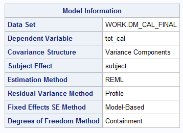
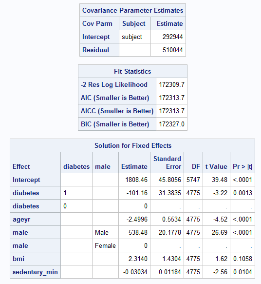
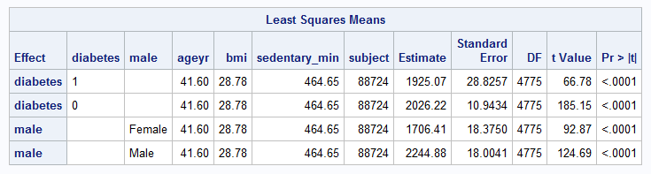

```{r setup, include=FALSE}
knitr::opts_chunk$set(echo = TRUE)
library(tidyverse)
library(kableExtra)
```

## Introduction

Diabetes is a major public health concern in the United State. An estimated 30.3 million people in the U.S., or 9.4% of the population, have diabetes [1]. It also imposes a substantial burden on society, provided that the total estimated cost of diagnosed diabetes in 2017 was \$327 billion, including \$237 billion in direct medical costs and \$90 billion in reduced productivity [2]. As a management of diabetes, people who are diagnosed with diabetes are advised to control their diet and choose foods that are lower in calories for their health [3]. However, it is unclear if people in the U.S. actually follow this guideline. 

Hence, the research question we are going to answer in this report is:

**Do people diagnosed with diabetes consume fewer calories in the United States?** 

We found it to be an interesting question and worth studying, given the high prevalence of diabetes and the importance of diet control in diabetes self-management.  

We plan to use National Health and Nutrition Examination Survey (NHANES) data, and fit a Linear Mixed Model(LMM) to analyze the effect of diabetes diagnosis on an individual's daily consumption of total calories, controling for other covariates. The LMM result will give us information on the calorie intake difference among people with and without diabetes.


## Data  

We used the National Health and Nutrition Examination Survey (NHANES) [2015-2016](https://wwwn.cdc.gov/nchs/nhanes/continuousnhanes/default.aspx?BeginYear=2015) data, which is publicly available on Centers for Disease Control and Prevention (CDC) website.   

The datasets and variables we used for our research question are summarized below:  

Dataset | Dataset Description | Variable name | Variable Description | Variable type  
------------- | ------------ | ------------- | ------------| -------------
(ALL) | | SEQN | Respondent<br> sequence number | Numeric  
[**Demographics data**](https://wwwn.cdc.gov/nchs/nhanes/search/datapage.aspx?Component=Demographics&CycleBeginYear=2015) | | | 
DEMO_I | Demographics | RIDAGEYR | Age in years at screening | Numeric 
DEMO_I | Demographics | RIAGENDR | Gender | Numeric 
DEMO_I | Demographics | RIDEXPRG | Pregnancy status at exam | Numeric 
[**Dietary data**](https://wwwn.cdc.gov/nchs/nhanes/search/datapage.aspx?Component=Dietary&CycleBeginYear=2015) | | |
DR1TOT_I | Total Nutrient Intakes<br> First Day | DR1TKCAL | Energy (kcal) | Numeric
DR2TOT_I | Total Nutrient Intakes<br> Second Day |DR2TKCAL | Energy (kcal) | Numeric
[**Examination data**](https://wwwn.cdc.gov/nchs/nhanes/search/datapage.aspx?Component=Examination&CycleBeginYear=2015) | | |
BMX_I | Body Measurement | BMXBMI | Body Mass Index (kg/m$^2$) | Numeric
[**Questionnaire data**](https://wwwn.cdc.gov/nchs/nhanes/Search/DataPage.aspx?Component=Questionnaire&CycleBeginYear=2015) | | |
DIQ_I | Diabetes | DIQ010 | Doctor told you have diabetes | Numeric
PAQ_I | Physical Activity | PAD615 | Minutes vigorous-intensity work | Numeric
PAQ_I | Physical Activity | PAD630 | Minutes moderate-intensity work | Numeric
PAQ_I | Physical Activity | PAD680 | Minutes sedentary activity | Numeric


## Methods  

### Model
Linear mixed model (LMM) is an extension of simple linear model to include both fixed and random effects. It is particular useful when there is non independence in the data [4]. In NHANES data, participants were interviewed for dietary intake on two different days, thus the total calorie intake data for the same respondent is not independent. Hence, we fitted an LMM to analyze the effect of diabetes diagnosis on consumption of total calories from both interview days, controlling for demographics, BMI and physical activity, and including a random intercept for each respondent.

*Note: NHANES has sampling weights associated with each respondent. However, in our analysis, we treate each respondent as i.i.d. data, ignoring the sampling weights. *

### Steps

Below we provide detailed steps of our analysis: 

1. Data merging  

XPT files needed for the analysis were downloaded from the CDC website. Different datasets were merged into one using SEQN (respondent sequence number), and only variables we listed in the above [Data](#data) section were included in the merged data.  

We have one merged dataset for day 1 only, one for day 2 only, and another one with day 1 and day 2 data stacked together.  

2. Inclusion/exclusion criteria  

Respondents with unknown diabetes are excluded from analysis.  

Respondents with confirmed pregnancy (RIDEXPRG) were excluded from our analysis.  

Ages over 89 are considered protected health infomration (PHI) [5]. Therefore, to avoid identifiability, NHANES data top-coded age variable ([RIDAGEYR](https://wwwn.cdc.gov/nchs/nhanes/2015-2016/DEMO_I.htm#RIDAGEYR)) at 80 years old, which means respondents aged 80 or older were all recorded as 80 in NHANES demographics data. As a result, We only include adolescent and adult respondents aged 12 to 79 in our analysis.  

3. Variable recoding  

We created a new binary `diabetes` variable, where respondents with diabetes diagnosis or borderline diagnosis are both considered positive (1) in this new variable, and respondents with confirmed non-diabetes diagnosis are considered negative (0).  

We recoded the two-level (1 vs 2) gender variable to a new `male` variable, where 1 indicates male, and 0 indicates female.  

We added a `day` variable to indicate the dietary interview day (1 or 2).  

4. Missing pattern checks

Missingness of each variable was checked in our analysis. Variables with large proportion of missing were furthre excluded from our analysis. 

Observations with missing in any of the variables we are going to use were deleted from the final working dataset.  

5. Normality examination  

We checked the normality of our response variable - total energy (kcal), by interview day, and discussed the necessity of transformation.  

6. Multicollinearity inspection  

The correlation matrix of predictors were examined. 

We then fitted a simple linear regression model using day 1 data only, and examined the variance inflation factor (VIF) to assess multicollinearity.  

Predictors were the selected based on the multicollinearity inspection results.

7. Model fitting  

We used both days' data to then fit a linear mixed model, including a random intercept for each respondent. 

8. Predicted total calorie intake at population means 

We provided predicted total calorie intake by diabetes and gender status when continuous covariates are held at population means. 


### Software/tools
The data preparation, model checking and model fitting were performed parallel in R [6], SAS [7], and Python [8]. The core packages/functions used for LMM are R - lmer4 package [9], SAS - proc mixed [10], and Python statsmodels package [11]. A summary of tools we used is shown in the table below: 

```{r, echo = FALSE}
Language = c("R", "SAS", "Python")
Version = c("3.6.0", "9.4", "3.6")
LMM = c("lme4", "proc mixed", "statsmodels")
Others = c("foreign, tidyr, plyr, dplyr, corrplot, ggplot2, ggpredict", "proc reg", "pandas, dfply, scipy, matplotlib, patsy")

tools = tibble(Language = Language, 
               Version = Version, 
               LMM = LMM, 
               Others = Others)

tools %>% 
  kable(align = c("cccc")) %>% 
  kable_styling("hover", full_width = FALSE) %>% 
  column_spec(3:4, width = "5cm") %>% 
  add_header_above(c(" " = 2, "Packages/Functions" = 2))
```


## Core Analysis {.tabset .tabset-fade .tabset-pills}

### R 
```{r setup_r, include=FALSE}
## Group project - R
##
## Question: Do people diagnosed with diabetes consume fewer calories in the US?
##
## Author: Bei An (anbei@umich.edu)
## Updated: Dec 11, 2019
# 80: -------------------------------------------------------------------------

# set up
library(foreign)
library(tidyr)
library(plyr)
library(dplyr)
library(corrplot)
library(lme4)
library(ggplot2)
library(ggeffects)
```
**Question: Do people diagnosed with diabetes consume fewer calories in the US?**

```{r, warning=FALSE}
DEMO = read.xport("./Data/DEMO_I.XPT")
DIQ = read.xport("./Data/DIQ_I.XPT")
PAQ = read.xport("./Data/PAQ_I.XPT")
DR1 = read.xport("./Data/DR1TOT_I.XPT")
DR2 = read.xport("./Data/DR2TOT_I.XPT")
BMX = read.xport("./Data/BMX_I.XPT")
```

Variables of interest:

| Dataset | Variable Name | Variable Description            | Notes on variable use            |
|:------- |:------------- |:------------------------------- |:-------------------------------- |
| (ALL)   | SEQN          | Respondent sequence number      | For merging purpose              |
| DEMO    | RIDAGEYR      | Age in years at screening       | Top-coded at 80 and above,       |
|         |               |                                 | convert to age groups            |
|         | RIAGENDR      | Gender                          |                                  |
|         | RIDEXPRG      | Pregnancy status at exam        | Exclude pregnant participants    |
| DIQ     | DIQ010        | Doctor told you have diabetes   | Binary                           |
| PAQ     | PAD615        | Vigorous-intensity work (min)   |                                  |
|         | PAD630        | Moderate-intensity work (min)   |                                  |
|         | PAD680        | Sedentary activity (min)        |                                  |
| DR1     | DR1TKCAL      | Energy (kcal)                   | Response variable                |
| DR2     | DR2TKCAL      | Energy (kcal)                   | Response variable                |
| BMX     | BMXBMI        | Body Mass Index (kg/m**2)       |                                  |

```{r, warning=FALSE}
# Merge all of the relevant variables
dm = join_all(list(DEMO[,c("SEQN", "RIDAGEYR", "RIAGENDR", "RIDEXPRG")],
                   DIQ[,c("SEQN", "DIQ010")],
                   PAQ[,c("SEQN", "PAD615", "PAD630", "PAD680")],
                   DR1[,c("SEQN", "DR1TKCAL")],
                   DR2[,c("SEQN", "DR2TKCAL")],
                   BMX[,c("SEQN", "BMXBMI")]),
              by = "SEQN")
names(dm) = c("SEQN","age","gender","pregnancy","DIQ010",
              "vig_work","mod_work","sed_act","DR1","DR2","bmi")
```

```{r, warning=FALSE}
# create a "not in" operator
`%notin%` = Negate(`%in%`)

# exclude data without diabetes diagnosis
c = c(1,2,3)
dm = dm[-which(dm$DIQ010 %notin% c), ]

# exclude pregnant participants
dm = dm[-which(dm$pregnancy==1), ]

# create a new variable representing diabetes
  # 1 - diabetes or borderline
  # 0 - non-diabetes
dm$diabetes = ifelse(dm$DIQ010==2, 0, 1)

# create a new variable representing male
  # 1 - male
  # 0 - female
dm$male = ifelse(dm$gender==1, 1, 0)

# pivot the data into "long" format
# and create a variable representing dietary interview day (1/2)
dm = dm %>%
  pivot_longer(
    cols = starts_with("DR"),
    names_to = "day",
    names_prefix = "DR",
    values_to = "kcal",
    values_drop_na = FALSE
    )%>%
  arrange(SEQN, day)

# check for missing values for each variable
colSums(is.na(dm))
```


`vig_work` and `mod_work` have much more missing values than other variables, so it is
reasonable to remove them from the data frame.  
`pregnancy` can also be removed since we only need this variable to filter out pregnant
individuals.  
`DIQ010` and `gender` are now redundant due to the new variables.  

Note that `age` is top-coded at 80, which means participants aged 80 or older were all
recorded as age 80. To avoid inaccurate data, we decided to set an age bound from 12 to 79.


```{r, warning=FALSE}
dm = dm %>%
  select(-pregnancy, -vig_work, -mod_work, -DIQ010, -gender) %>%
  filter(age>=12 & age<=79)
dm$day = as.numeric(dm$day)
# remove rows with missing value
dm_final = dm[complete.cases(dm),]
dr1_final = dm_final[dm_final$day==1,]
dr2_final = dm_final[dm_final$day==2,]
```

```{r, warning=FALSE}
# check if the response variable - kcal is normally distributed
# day1
ggplot(dr1_final, aes(x = kcal)) + 
  geom_histogram(aes(y = ..density..), 
                 bins = 100, 
                 fill = "blue", 
                 alpha = 0.8) + 
  stat_function(fun = dnorm, 
                args = list(mean = mean(dr1_final$kcal), 
                            sd = sd(dr1_final$kcal))) + 
  labs(x = "Total Energy (kcal)", y = "Frequency") + 
  theme_bw()
# day2
ggplot(dr2_final, aes(x = kcal)) + 
  geom_histogram(aes(y = ..density..), 
                 bins = 100, 
                 fill = "blue", 
                 alpha = 0.8) + 
  stat_function(fun = dnorm, 
                args = list(mean = mean(dr2_final$kcal), 
                            sd = sd(dr2_final$kcal))) + 
  labs(x = "Total Energy (kcal)", y = "Frequency") + 
  theme_bw()
```


`kcal` seems to be approximately normal with a longer right tail for both day1 and day2.
In this case, no transformation would be needed.


```{r, warning=FALSE}
# fit a linear regression model
model = dr1_final %>% 
  lm(formula = kcal ~ age + sed_act + bmi + factor(diabetes) + factor(male))
# check collinearity
summary(model)
faraway::vif(model)
cor1 = cor(dr1_final[, c("age", "sed_act", "bmi", "diabetes", "male")])
cor1
corrplot(cor1)
```


No collinearity found.


```{r, warning=FALSE}
# fit a linear mixed model
model2 = dm_final %>% 
  lmer(formula = kcal ~ age + sed_act + bmi + factor(diabetes) + factor(male) + (1|SEQN))
summary(model2)
```


```{r}
# Predicted total energy intake at population mean
me = ggpredict(model2, c("diabetes","male"))
plot(me, dodge = 0)
```


### SAS 
```sas
/******************************************************************************/
* Stats 506, Fall 2019														   ;
* Group Project - Group 3													   ;
*------------------------------------------------------------------------------;
* This script analyzes the question:										   ;
* 	"Do people diagnosed with diabetes consume fewer calories in US?"		   ;
* NHANES 2015-2016 data are used in this problem. 							   ;
* The script has following parts to complete the task:						   ;
* A. Merge source data														   ;
* 	 Merge information from:												   ;
*		Demographics - subject ID, age, gender								   ;
*		Dietary - subject ID, total calories (day 1), total calories (day 2)   ;
*		Examination - subject ID, BMI										   ;
*	    Questionnaire - subject ID, diabetes, pregnancy						   ;
*					  - vigorous/moderate/sedentary activity minutes		   ;
* B. Check missing patterns													   ;
*	 Check missing patterns of all variables								   ;
*	 Take a closer look at three physical activity variables				   ; 
* C. Handle top-coded age													   ;
*	 NHANES data top-coded age at 80 and above. 							   ;
*	 Choose a method to handle it appropriately.							   ;
* D. Transformation of response variable									   ;
*	 Examine the normality of response variable								   ;
*	 Determine whether a transformation is needed							   ;
* E. Initial model to examine collinearity - use Day 1 only					   ;
*	 Use day 1 data only to fit a linear regressio model					   ;
*	 Determine if multicollinearity issue exists							   ;
*	 If yes, handle if appropriately										   ;
* F. Linear mixed model to account for both day 1 and day 2					   ;
*	 Fit a linear mixed model to include both days data						   ;
*	 Include a random intercept for each subject							   ;
*------------------------------------------------------------------------------;
* Author: Jie Cao (caojie@umich.edu)										   ;
* Last updated on: Dec 3, 2019												   ;
/******************************************************************************/


* 80: -------------------------------------------------------------------------;


/* Data directory ----------------------------------------------------------- */
* List of XPT data downloaded from 2015 - 2016 NHANES;
libname DEMO xport "M:\506\data\XPT\DEMO_I.XPT"; 
libname DIQ xport "M:\506\data\XPT\DIQ_I.XPT";
libname PAQ xport "M:\506\data\XPT\PAQ_I.XPT";
libname DR1 xport "M:\506\data\XPT\DR1TOT_I.XPT";
libname DR2 xport "M:\506\data\XPT\DR2TOT_I.XPT";
libname BMX xport "M:\506\data\XPT\BMX_I.XPT";

* Directory to save datasets extracted from XPT files; 
libname NH "M:\506\data\SAS"; 


/* Extract XPT files and save as SAS datasets ------------------------------- */
proc copy in = DEMO out = NH;
run;
proc copy in = DIQ out = NH;
run;
proc copy in = PAQ out = NH;
run;
proc copy in = DR1 out = NH;
run;
proc copy in = DR2 out = NH;
run;
proc copy in = BMX out = NH;
run;


/* Formats ------------------------------------------------------------------- */
proc format;
	/* A format to flag numeric varibles with missing status */
	value missfmt 
		. = "Missing" 
		other = "Non-missing";
	/* Gender format */
	value male
		0 = "Female"
		1 = "Male";
run;
```


```sas
/* Prepare working data ------------------------------------------------------ */

***************************;
* A. Merge source data     ;
****************************

* Dietary day 1 interview plus needed variables;
proc sql;
	create table dr1 as
	select dm.SEQN as subject,
		   1 as day,   
			(case 
			 /* DIQ010 = 2: doctor confirmed no diabetes */ 
			 when dm.DIQ010 = 2 then 0 
			 /* DIQ010 = 1 or 3: doctor confirmed diabetes (1) or borderline (3) */
			 else 1
			 end) as diabetes, 
		   demo.RIDAGEYR as ageyr , 
			(case
			 when demo.RIAGENDR = 1 then 1 
			 when demo.RIAGENDR = 2 then 0 
			 else .
			 end) as male format male., 
		   bm.BMXBMI as bmi, 
		   pa.PAD615 as vigorous_min, 
		   pa.PAD630 as moderate_min, 
		   pa.PAD680 as sedentary_min, 
		   dr1.DR1TKCAL as tot_cal
		    
	from NH.Diq_i dm 
	left join NH.Demo_i demo on dm.SEQN = demo.SEQN
	left join NH.Bmx_i bm on dm.SEQN = bm.SEQN
	left join NH.Paq_i pa on dm.SEQN = pa.SEQN
	left join NH.Dr1tot_i dr1 on dm.SEQN = dr1.SEQN
	
	/* Include subjects with known answers to diabete diagnosis &
	   exclude participants confirmed with pregnancy */
	where dm.DIQ010 in (1, 2, 3) and demo.RIDEXPRG NE 1;
quit;
```

NOTE: Table WORK.DR1 created, with 9501 rows and 10 columns.

```sas
* Dietary day 2 interview plus needed variables; 
proc sql;
	create table dr2 as
	select dm.SEQN as subject,
		   2 as day,   
			(case 
			 /* DIQ010 = 2: doctor confirmed no diabetes */ 
			 when dm.DIQ010 = 2 then 0 
			 /* DIQ010 = 1 or 3: doctor confirmed diabetes (1) or borderline (3) */
			 else 1
			 end) as diabetes, 
		   demo.RIDAGEYR as ageyr,  
			(case
			 when demo.RIAGENDR = 1 then 1 
			 when demo.RIAGENDR = 2 then 0 
			 else .
			 end) as male format male.,  
		   bm.BMXBMI as bmi, 
		   pa.PAD615 as vigorous_min, 
		   pa.PAD630 as moderate_min, 
		   pa.PAD680 as sedentary_min, 
		   dr2.DR2TKCAL as tot_cal
		    
	from NH.Diq_i dm 
	left join NH.Demo_i demo on dm.SEQN = demo.SEQN
	left join NH.Bmx_i bm on dm.SEQN = bm.SEQN
	left join NH.Paq_i pa on dm.SEQN = pa.SEQN
	left join NH.Dr2tot_i dr2 on dm.SEQN = dr2.SEQN

	/* Include subjects with known answers to diabete diagnosis &
	   exclude participants confirmed with pregnancy */
	where dm.DIQ010 in (1, 2, 3) and demo.RIDEXPRG NE 1;
quit;
```

NOTE: Table WORK.DR2 created, with 9501 rows and 10 columns.

```sas
* Combine two days' data; 
proc sql;
	create table dm_cal as
	select * 
	from dr1 
	outer union corr
	select * 
	from dr2
	order by subject, day;
quit;
```

NOTE: Table WORK.DM_CAL created, with 19002 rows and 10 columns.

```sas
**********************************************;
* B. Check missing patterns 				  ;
**********************************************;

* Add variables to count number of missing; 
data check;
	set dm_cal;
	/* Number of missing among three physical activity minutes 
	   for each participant */
	mins_miss = cmiss(of vigorous_min--sedentary_min);
	/* Number of missing among all (numeric) variables we may 
	   potentially use for each participant */
	nmiss = cmiss(of diabetes--tot_cal);
run;
* Tabulate number of missing;
proc sort data = check;
	by day;
run;
proc freq data = check;
	tables mins_miss nmiss;
	by day;
run;
```

1064 (11.2%) have complete three physical activity minutes data, both day 1 and day 2; 

979 (10.3%) have complete all numeric data for day 1;

801 (8.4%) have complete all numeric data for day 2;  

```sas
* Check missing patterns for numeric variables we are interested in;
proc freq data = check;
	format diabetes--tot_cal missfmt.; 
	tables diabetes--tot_cal / missing missprint nocum;
	by day;
run;
```
No missing in diabetes (by nature of merging process), age, gender; 

BMI: 818 (8.6%) missing in both day 1 and day 2;  

Vigorous_min: 8156 (85.8%) missing in both day 1 and day 2;  

Moderate_min: 6942 (73.1%) missing in both day 1 and day 2;

Sedentary_min: 2624 (27.6%) missing in both day 1 and day 2; 

tot_cal: 1452 (15.3%) missing in day 1, 2862 (30.1%) in day 2;  

**Conclusion**: we decide not to use vigorous activity minutes and moderate activity minutes due to large amount of missing. 

```sas
********************************;
* C. Handle top-coded age	    ;
********************************;
/* NHANES top-coded age variable at 80 years, therefore, we consider recode age 
   into age groups. */ 
data dm_cal;
	set dm_cal;
	/* Restrict to age 12+ */
	where 12 <= ageyr < 80;
run;
```

NOTE: There were 13172 observations read from the data set WORK.DM_CAL.
      WHERE (ageyr>=12 and ageyr<80);
      
NOTE: The data set WORK.DM_CAL has 13172 observations and 10 variables.

```sas
*******************************************
* D. Transformation of response variable  ;
******************************************;
/* Examine the distribution of response variable */
proc univariate data = dm_cal;
	var tot_cal;
	histogram tot_cal / normal;
	class day;
run;
```

<div align=center> 

</div>

**Conclusion**: The response variable (total energy) approximately follows normal distribution, thus, no transformation is needed. 

```sas 
/* Modeling ----------------------------------------------------------------- */

************************************************************;
* E. Initial model to examine collinearity - use Day 1 only ;
************************************************************;
data dm_cal_final dr1_final dr2_final;
	set dm_cal(drop = vigorous_min moderate_min);
	/* Remove observations with missing in any of the variables*/
	if cmiss(of _all_) then delete;
	
	/* Output two day's, day 1 only and day 2 only data */
	output dm_cal_final;
	if day = 1 then output dr1_final;
	if day = 2 then output dr2_final;
run;
```

NOTE: There were 13172 observations read from the data set WORK.DM_CAL.

NOTE: The data set WORK.DM_CAL_FINAL has 10528 observations and 8 variables.

NOTE: The data set WORK.DR1_FINAL has 5752 observations and 8 variables.

NOTE: The data set WORK.DR2_FINAL has 4776 observations and 8 variables.


```sas 
/* Examine the correlation matrix */
proc corr data = dr1_final;
	var diabetes ageyr male bmi sedentary_min;
run;
```

<div align=center> 

</div>


Above is the correlation matrix for the five predictors we picked. We want to check if any of the variables included have a high correlation - about 0.8 or higher - with any other variable. Upon review of this correlation matrix, there does not appear to be any pair of variable with a particular high correlation. 

```sas
/* Multicollinearity Investigation of VIF */
proc reg data = dr1_final;
	model tot_cal = diabetes ageyr male bmi sedentary_min / vif tol collin; 
run; 
```

<div align=center> 


</div>

Next, we fit an ordinary linear regression model. In the above results, we check Variance Inflation Factor (VIF) or Tolerance (1/VIF) for potential multicollinearity. VIF greater than 10 or Tolerance less than 0.1 should be warned if exists. Obviously, there is no treat of multicollinearity indicated in our model. 

We further look at the collinearity diagnostics (eigenvalues and condition numbers). If one or more of the eigenvalues are small (close to zero) and the corresponding condition number being large, then we have an indication of multicollinearity. As we can see from the above results, none of our eigenvalues and condition index associations match this description. 

**Conclusion**: No multicollinearity issue found in our model. 

```sas
************************************************************;
* F. Linear mixed model to account for both day 1 and day 2 ;
************************************************************;
proc mixed data = dm_cal_final;
  class diabetes(ref = "0") male;
	model tot_cal = diabetes ageyr male bmi sedentary_min / s;
	random intercept / subject = subject;
	lsmeans diabetes male / at means;
run;


* 80: -------------------------------------------------------------------------;
```

<div align=center> 







</div>


### Python 


#### Stats 506, Fall 2019
##### Group Project - Group 3

**Author: Wenjing Li**

**Date: Dec.11, 2019**

 This script analyzes the question:
 
**"Do people diagnosed with diabetes consume fewer calories in US?"**

NHANES 2015-2016 data are used in this problem.


##### Import packages


```python
import pandas as pd
from dfply import *
from scipy import stats
import statsmodels.api as sm
import statsmodels.formula.api as smf
import matplotlib.pyplot as plt
from patsy import dmatrices
from statsmodels.stats.outliers_influence import variance_inflation_factor
```

##### Read data
List of XPT files from NHANES 2015-2016 that we will use in this analysis.  

DEMO_I - Demographics  

DR1TOT_I - Dietary, Day 1  

DR2TOT_I - Dietary, Day 2  

BMX_I - Body Measusrement  

DIQ_I - Diabetes

PAQ_I - Physical Activity


```python
demo = pd.read_sas('../Data/DEMO_I.XPT')
dr1tot = pd.read_sas('../Data/DR1TOT_I.XPT')
dr2tot = pd.read_sas('../Data/DR2TOT_I.XPT')
bmx = pd.read_sas('../Data/BMX_I.XPT')
diq = pd.read_sas('../Data/DIQ_I.XPT')
pad = pd.read_sas('../Data/PAQ_I.XPT')
```

##### Merge data

###### Select columns needed


```python
demo_new = (demo >> 
            select(X.SEQN, X.RIDAGEYR, X.RIAGENDR, X.RIDEXPRG))

dr1tot_new = (dr1tot >>
              mutate(dr1 = X.DR1TKCAL) >>
              select(X.SEQN, X.dr1))
dr2tot_new = (dr2tot >>
              mutate(dr2 = X.DR2TKCAL) >>
             select(X.SEQN, X.dr2))
dietary = pd.merge(dr1tot_new, dr2tot_new, on='SEQN', how='outer')
bmx_new = (bmx >>
          select(X.SEQN, X.BMXBMI))
diq_new = (diq >>
          select(X.SEQN, X.DIQ010))
pad_new = (pad >>
          select(X.SEQN, X.PAD615, X.PAD630, X.PAD680))
questionnaire = pd.merge(diq_new, pad_new, on='SEQN', how='outer')
merge_2 = pd.merge(bmx_new, questionnaire, on='SEQN', how='outer')
merge_3 = pd.merge(merge_2, demo_new, on='SEQN', how='outer')
```

###### Inclusion/Exclusion

Include data with confirmed diabetes diagnosis


```python
# Diabetes yes/no/borderline
diabetes_in = [1, 2, 3]
merge_3 = merge_3[merge_3.DIQ010.isin(diabetes_in)]
```

Exclude pregnant participants


```python
merge_3 = merge_3[merge_3.RIDEXPRG != 1 ]
```

Include participants aged 12-79 years old

NHANES top-coded age at 80, which means participants aged 80 or older are all coded as 80. 

Hence, we decide to only look at adolescents greater than 12 years old) and adults less than 80 years old. 


```python
merge_3 = merge_3[merge_3.RIDAGEYR < 80]
merge_3 = merge_3[merge_3.RIDAGEYR >= 12]
```


```python
merge_3.shape
```


    (6586, 9)


###### Variable recoding/creation

Binary **diabetes** variable:

1 - diabetes or borderline

0 - non-diabetes


```python
diabete = []
for i in merge_3.DIQ010:
    if i == 2:
        diabete.append(0)
    else:
        diabete.append(1)
merge_3['diabetes'] = diabete
```

Binary **male** variable:

1 - male

0 - female


```python
male = []
for i in merge_3.RIAGENDR:
    if i == 1:
        male.append(1)
    else:
        male.append(0)
merge_3['male'] = male
```

Dietary intervew **day** variable: 

1 - interview day 1  

2 - interview day 2


```python
merge = pd.merge(merge_3, dietary, on='SEQN', how='left')

# pivot the data into "long" format
merge = merge.melt(id_vars=merge.iloc[:,0:11], var_name='day', value_name='y')

# create a variable representing dietary interview day (1/2)
days = []
for i in merge.day:
    if i == 'dr1':
        days.append(1)
    else:
        days.append(2)
merge['day'] = days
```

###### Prepare final working datasets


```python
# remove rows with missing value
final = merge.drop(["RIDEXPRG", "RIAGENDR", "PAD615", "PAD630", "DIQ010"], axis=1)
# remove rows with any missing value
final = final.dropna()
final_day1 = final[final["day"] == 1]
final_day2 = final[final["day"] == 2]
```


```python
final.shape
```


    (10528, 8)


```python
final_day1.shape
```


    (5752, 8)


```python
final_day2.shape
```


    (4776, 8)


###### Check normality of response variable

Day 1 Total Energy (kcal)


```python
plt.hist(final_day1["y"], bins=100, density=1)
plt.savefig('./Figs/hist_day1.png')
plt.show()
```


Day 2 Total Energy (kcal)


```python
plt.hist(final_day2["y"], bins=100)
plt.savefig('./Figs/hist_day2.png')
plt.show()
```


**Conclusion**: Approximately normal - no need to transform the response variable.

###### Check collinearity (use day 1 only)

Correlation matrix of predictors


```python
predictors = final_day1[final_day1.columns[1:6]]
predictors.corr()
```


<div>
<style scoped>
    .dataframe tbody tr th:only-of-type {
        vertical-align: middle;
    }

    .dataframe tbody tr th {
        vertical-align: top;
    }

    .dataframe thead th {
        text-align: right;
    }
</style>
<table border="1" class="dataframe">
  <thead>
    <tr style="text-align: right;">
      <th></th>
      <th>BMXBMI</th>
      <th>PAD680</th>
      <th>RIDAGEYR</th>
      <th>diabetes</th>
      <th>male</th>
    </tr>
  </thead>
  <tbody>
    <tr>
      <th>BMXBMI</th>
      <td>1.000000</td>
      <td>-0.010791</td>
      <td>0.242742</td>
      <td>0.222468</td>
      <td>-0.088875</td>
    </tr>
    <tr>
      <th>PAD680</th>
      <td>-0.010791</td>
      <td>1.000000</td>
      <td>-0.034440</td>
      <td>-0.009275</td>
      <td>-0.017472</td>
    </tr>
    <tr>
      <th>RIDAGEYR</th>
      <td>0.242742</td>
      <td>-0.034440</td>
      <td>1.000000</td>
      <td>0.341760</td>
      <td>-0.009280</td>
    </tr>
    <tr>
      <th>diabetes</th>
      <td>0.222468</td>
      <td>-0.009275</td>
      <td>0.341760</td>
      <td>1.000000</td>
      <td>0.025974</td>
    </tr>
    <tr>
      <th>male</th>
      <td>-0.088875</td>
      <td>-0.017472</td>
      <td>-0.009280</td>
      <td>0.025974</td>
      <td>1.000000</td>
    </tr>
  </tbody>
</table>
</div>


OLS model for day 1


```python
x = sm.add_constant(final_day1[final_day1.columns[1:6]])
model = sm.OLS(final_day1['y'], x)
results = model.fit()
print(results.summary())
```

                                OLS Regression Results                            
    ==============================================================================
    Dep. Variable:                      y   R-squared:                       0.095
    Model:                            OLS   Adj. R-squared:                  0.094
    Method:                 Least Squares   F-statistic:                     120.7
    Date:                Wed, 11 Dec 2019   Prob (F-statistic):          8.08e-122
    Time:                        21:55:47   Log-Likelihood:                -47383.
    No. Observations:                5752   AIC:                         9.478e+04
    Df Residuals:                    5746   BIC:                         9.482e+04
    Df Model:                           5                                         
    Covariance Type:            nonrobust                                         
    ==============================================================================
                     coef    std err          t      P>|t|      [0.025      0.975]
    ------------------------------------------------------------------------------
    const       1845.4133     55.121     33.479      0.000    1737.355    1953.472
    BMXBMI         5.4510      1.727      3.156      0.002       2.065       8.837
    PAD680        -0.0405      0.014     -2.876      0.004      -0.068      -0.013
    RIDAGEYR      -3.8870      0.667     -5.827      0.000      -5.195      -2.579
    diabetes    -116.0930     37.896     -3.063      0.002    -190.383     -41.803
    male         565.2939     24.269     23.293      0.000     517.718     612.870
    ==============================================================================
    Omnibus:                     1368.319   Durbin-Watson:                   2.034
    Prob(Omnibus):                  0.000   Jarque-Bera (JB):             4401.805
    Skew:                           1.199   Prob(JB):                         0.00
    Kurtosis:                       6.552   Cond. No.                     4.59e+03
    ==============================================================================
    
    Warnings:
    [1] Standard Errors assume that the covariance matrix of the errors is correctly specified.
    [2] The condition number is large, 4.59e+03. This might indicate that there are
    strong multicollinearity or other numerical problems.


Variance Infation Factor (VIF)


```python
# Break into left and right hand side; y and X
y, X = dmatrices("y ~ BMXBMI + PAD680 + RIDAGEYR + diabetes + male", data=final_day1, return_type="dataframe")

# For each Xi, calculate VIF
vif = [variance_inflation_factor(X.values, i) for i in range(X.shape[1])]
vif[1:] # No need to look at VIF for intercept
```


    [1.0980699620399632,
     1.0015371700466498,
     1.1722346969542117,
     1.1618062474485058,
     1.0105433137760211]


**Conclusion**: No collinearity issue.

###### Linear mixed model for both days


```python
# LMM model
mixed = smf.mixedlm("y ~ BMXBMI + PAD680 + RIDAGEYR + diabetes + male", final, groups = final["SEQN"])
mixed_fit = mixed.fit()
#print the summary
print(mixed_fit.summary())
```

               Mixed Linear Model Regression Results
    ============================================================
    Model:             MixedLM  Dependent Variable:  y          
    No. Observations:  10528    Method:              REML       
    No. Groups:        5752     Scale:               510040.7789
    Min. group size:   1        Likelihood:          -86154.8654
    Max. group size:   2        Converged:           Yes        
    Mean group size:   1.8                                      
    ------------------------------------------------------------
                Coef.    Std.Err.   z    P>|z|  [0.025   0.975] 
    ------------------------------------------------------------
    Intercept   1808.464   45.807 39.480 0.000 1718.684 1898.244
    BMXBMI         2.314    1.430  1.618 0.106   -0.489    5.118
    PAD680        -0.030    0.012 -2.563 0.010   -0.054   -0.007
    RIDAGEYR      -2.500    0.553 -4.517 0.000   -3.584   -1.415
    diabetes    -101.157   31.384 -3.223 0.001 -162.669  -39.646
    male         538.477   20.178 26.686 0.000  498.928  578.025
    Group Var 292948.651   22.660                               
    ============================================================
    


Prediction at population mean, by diabetes and gender


```python
# prediction for person who has diabetes
diabetes = 1
## for man
male = 1
pre_1 = 1808.464+2.314*mean(final['BMXBMI'])-0.030*mean(final['PAD680'])-2.500*mean(final['RIDAGEYR'])- \
        101.157*diabetes+538.477*male
## for woman
male = 0
pre_2 = 1808.464+2.314*mean(final['BMXBMI'])-0.030*mean(final['PAD680'])-2.500*mean(final['RIDAGEYR'])- \
        101.157*diabetes+538.477*male

# prediction for person who doesn't have diabetes
diabetes = 0
## for man
male = 1
pre_3 = 1808.464+2.314*mean(final['BMXBMI'])-0.030*mean(final['PAD680'])-2.500*mean(final['RIDAGEYR'])- \
        101.157*diabetes+538.477*male
## for woman
male = 0
pre_4 = 1808.464+2.314*mean(final['BMXBMI'])-0.030*mean(final['PAD680'])-2.500*mean(final['RIDAGEYR'])- \
        101.157*diabetes+538.477*male
```


```python
print('In the population mean, the estimated calorie intake for men diagnosed with diabetes is :', round(pre_1, 2),'\n' \
      'In the population mean, the estimated calorie intake for women diagnosed with diabetes is :', round(pre_2, 2),'\n' \
      'In the population mean, the estimated calorie intake for men without diabetes is :', round(pre_3, 2),'\n' \
      'In the population mean, the estimated calorie intake for women without diabetes is :', round(pre_4, 2),'\n' \
     )
```

    In the population mean, the estimated calorie intake for men diagnosed with diabetes is : 2194.44 
    In the population mean, the estimated calorie intake for women diagnosed with diabetes is : 1655.97 
    In the population mean, the estimated calorie intake for men without diabetes is : 2295.6 
    In the population mean, the estimated calorie intake for women without diabetes is : 1757.12 
    


## Results  

### LMM summary

All three analysis tools we used (R-lmer4, SAS-proc mixed, Python-statsmodels) gave the same results. The estimates, 95% confidence intervals (CI) and p-values for the fixed effects are summarized in Table 1. 

```{r, echo = FALSE}
lmm_summary = summary(model2)

cap1 = paste("**Table 1**. Summary of fixed effects. ")

lmm_summary$coefficients %>% 
  as_tibble() %>% 
  mutate(Covariate = c("(Intercept)", "Age (yr)", "Sedentary Activity (minutes)", 
         "BMI (kg/m^2)", "Diabetes", "Male"), 
         `p-value` = 2 * pt(abs(`t value`), df = 4775, lower.tail = F), 
         lci = Estimate - 1.96 * `Std. Error`, 
         uci = Estimate + 1.96 * `Std. Error`) %>% 
  mutate(`Estimate` = sprintf("%.2f", Estimate), 
         `95% CI` = sprintf("(%.2f, %.2f)", lci, uci), 
         `p-value` = if_else(`p-value` < 0.0001, "<0.0001", sprintf("%.4f", `p-value`))) %>% 
  select(Covariate, Estimate, `95% CI`, `p-value`) %>% 
  kable(cap = cap1, align = "lccc") %>% 
  kable_styling("hover", full_width = FALSE)
```

Our LMM showed that the predictor variables of interest are all statistically significant at level of 0.05, except BMI, suggesting that these predictors, including diabetes status, have a significant effect on predicting the response variable - total daily consumption of calories. An individual with diabetes is predicted to consume 101 fewer calories compared to a non-diabetes individual, while other covariates are held the same. 


### Covariance component

The standard deviation for each covariance component (subject and error) are shown in the Table 2. 

```{r, echo = FALSE}
cap2 = paste("**Table 2**. Standard deviations for each variance component - subject and error. ")

VarCorr(model2) %>% 
  as_tibble() %>% 
  mutate(`Variance Component` = c("Subject", "Error"), 
         `Standard Deviation` = sdcor) %>% 
  select(`Variance Component`, `Standard Deviation`) %>% 
  kable(cap = cap2, align = "lc", digits = 2) %>% 
  kable_styling("hover", full_width = FALSE)
```


### Marginal effects

Marginal effect measures how the response variable changes when a specific predictor changes, while other covariates are assumed to be held constant. 

We used a continuous response variable in our LMM model, therefore, the marginal effects are equal to the beta coefficients we obtained from the model summary. Marginal effects for continuous covariates measure the instantaneous rate of change, i.e. an approximation of the amount of change in total calorie intake produced by one-unit change in age/BMI/Sedentary activity in our model. Marginal effects for binary covariates (diabetes and male in our model) measure discreate change, i.e. how many total calorie consumption change as the diabetes status changes no to yes, or gender changes from female to male. 

Since marginal effects for discrete variables are more meaningful, and we are interested in the effect of diabetes on total calorie intake, we present predicted total calorie intake by diabetes status and gender. 

First, we present the population means of the continuous covariates:
```{r, echo = FALSE}
cap3 = paste("**Table 3**.", 
             "Population means of continuous covariates", 
             "- Age, BMI and Sedentary Activity")

dm_final %>% 
  summarise(`Age (yr)` = mean(age), 
            `BMI (kg/m^2)` = mean(bmi), 
            `Sedentary Activity (minute)` = mean(sed_act)) %>% 
  mutate(Measure = "Mean") %>% 
  select(Measure, `Age (yr)`, `BMI (kg/m^2)`, `Sedentary Activity (minute)`) %>% 
  kable(cap = cap3, digits = 2, align = "lccc") %>% 
  kable_styling("hover", full_width = FALSE)
```

We also provide predicted consumption of daily total calories by diabetes and gender in the below table and figure. 

```{r, echo = FALSE}
me = ggpredict(model2, c("diabetes","male"))

# Table 
cap4 = paste("**Table 4**.", 
             "Predicted consumption of total calories (95% CI),", 
             "by diabetes status and gender.")

tibble(diabetes = c("Non-diabetes", "Non-diabetes", "Diabetes", "Diabetes"), 
       male = c("Female", "Male", "Female", "Male"), 
       pred_kcal = me$predicted, 
       se = me$std.error, 
       lci = me$conf.low, 
       uci = me$conf.high) %>% 
  mutate(pred = sprintf("%.2f (%.2f, %.2f)", pred_kcal, lci, uci)) %>% 
  select(diabetes, male, pred) %>% 
  pivot_wider(id_cols = diabetes, names_from = male, values_from = pred) %>% 
  mutate(`Diabetes Status` = diabetes) %>% 
  select(`Diabetes Status`, Female, Male) %>% 
  kable(cap = cap4, align = "lcc") %>% 
  kable_styling("hover", full_width = FALSE) %>% 
  column_spec(1, bold = TRUE)
  
# Figure
plot(me, dodge = 0)
```


**Conclusion: People diagnosed with diabetes consume fewer (~101 kcal) calories in the U.S. compared to non-diabetes individuals, if controlled for gender, age, BMI and sedentary activity.**  

Our conclusion indicates that diabetic individuals in the U.S generally follow the guideline to reduce their calorie consumption, while taking age, gender, BMI and sedentary activity into account. Further analyses could be done by controlling for more potential confounders and bring in sampling weights to better estimate the U.S. population distribution. 


## Discussion  

### Multicollinearity warning

We found an interesting warning message in Python analysis section, when we were examining multicollinearity by fitting a simple linear regression on day 1 data only.


*Warnings:*

    *[1] Standard Errors assume that the covariance matrix of the errors is correctly specified.*
    
    *<mark style="background-color: yellow">[2] The condition number is large, 4.59e+03. This might indicate that there are strong multicollinearity or other numerical problems.</mark>*

This is in contrast to the conclusion in R and SAS analysis sections. The correlation matrix, VIFs and eigenvalues/condition numbers inspection all agree with each other that no multicollinearity issue is found. Our Python analysis gave the same correlation matrix and VIFs as those where done in R and SAS. Therefore, we suspect Python package `statsmodels` uses a different strategy to obtain condition numbers. Interestingly, we found a similar [question](https://stats.stackexchange.com/questions/243000/cause-of-a-high-condition-number-in-a-python-statsmodels-regression) raised on StackExchange. There are also two open issues ([#553](https://github.com/statsmodels/statsmodels/issues/553) and [#2378](https://github.com/statsmodels/statsmodels/issues/2378)) on statsmodels' Github page. It seems that `statsmodels` report condition number as a ratio of largest to smallest eigenvalue, rather than one condition index for one eigenvalue reported by R or SAS. Hence, the high condition number may be due to scaling, not a true indicator of multicollinearity.  


### Difference in Prediction

Another interesting finding in our report is the difference in prediction of total calorie intake between R `ggpredict` function and SAS `lsmeans` in `proc mixed`. We intended to predict the total calorie intake by diabetes status and gender, while holding other continuous covariates at population means. We did not find a good tool to generate this prediction together with standard error/confidence interval automatically in Python, other than manual calculation. Hence, we only report findings from R and SAS, and used Python manual calculation as a verification. We have summarised our explanation below: 

Both methods gave the same population means (as shown in Table 3) for age, BMI and sedentary activity. The difference is that:

R `ggpredict` then predicts the total calorie intake for the 4 scenarios by taking diabetes and gender into account together, i.e. predict the total calorie intake when a. non-diabetes (diabetes = 0), female (male = 0), b. non-diabetes (diabetes = 0), male (male = 1), c. diabetes (diabetes = 1), female (male = 0), and d. diabetes (diabetes = 1), male (male = 1). We used the same strategy and manually calculated the prediction in Python to verify the results. 

SAS `lsmeans` predicts the total calorie intake for the 4 scenarios by counting for diabetes or gender separately over a balanced population, i.e. predict the total calorie intake when a. non-diabetes (diabetes = 0) with half female and half male, b. diabetes (diabetes = 1) with half female and half male, c. female (male = 0) with half diabetes and half non-diabetes, and d. male (male = 1) with half diabetes and half non-diabetes. 

While it is close to the truth that the gender distribution is balanced, it is unreasonable to assume balanced diabetes status in the population. Hence, we decide to report R `ggpredict` results in our Table 4. 


**Thoughts**: Based on two discussions we have above, in our example, R and SAS appear to be more powerful tools in statistical analysis than Python. It's likely because Python was developed for general-purpose, while both R and SAS were developed specifically for statistical computing. 


## Reference

[1] NIDDK. Diabetes Statistics. https://www.niddk.nih.gov/health-information/health-statistics/diabetes-statistics. Accessed 12/11/2019. 

[2] American Diabetes Association. Economic costs of diabetes in the US in 2017. *Diabetes care* 41, no. 5 (2018): 917-928.

[3] CDC. 4 Steps to Manage Your Diabetes. https://www.cdc.gov/diabetes/ndep/pdfs/4steps/4Steps-English.pdf. Accessed 12/11/2019. 

[4] UCLA Institute for Digital Research & Education. Introduction to Linear Mixed Models. https://stats.idre.ucla.edu/other/mult-pkg/introduction-to-linear-mixed-models/. Accessed 12/11/2019. 

[5] HIPPA. Guidance Regarding Methods for De-identification of Protected Health Information in Accordance with the Health Insurance Portability and Accountability Act (HIPAA) Privacy Rule. https://www.hhs.gov/hipaa/for-professionals/privacy/special-topics/de-identification/index.html. Accessed 12/11/2019. 

[6]. R Core Team (2019). R: A Language and Environment for Statistical Computing. R Foundation for Statistical Computing, Vienna. https://www.R-project.org

[7] SAS Institute Inc. SAS® 9.4. Cary, NC: SAS Institute Inc; 2019. 

[8] Python Software Foundation. Python Language Reference, version 3.6. http://www.python.org

[9] Douglas Bates and Martin Machler and Ben Bolker and Steve Walker. Fitting Linear Mixed-Effects Models Using lme4. *Journal of Statistical Software* 67(1), 1-48.

[10] SAS Institute Inc. 2017. *SAS/STAT® 14.3 User’s Guide*. Cary, NC: SAS Institute Inc. 

[11] Seabold, Skipper, and Josef Perktold. “Statsmodels: Econometric and statistical modeling with python.” *Proceedings of the 9th Python in Science Conference*. 2010.
