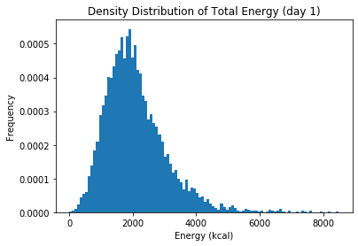
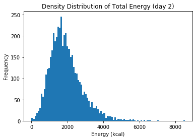

# Stats 506, Fall 2019
# Group Project - Group 3

 This script analyzes the question:
 
**"Do people diagnosed with diabetes consume less calories in US?"**

NHANES 2015-2016 data are used in this problem.


## Import packages


```python
import pandas as pd
from dfply import *
from scipy import stats
import statsmodels.api as sm
import statsmodels.formula.api as smf
import matplotlib.pyplot as plt
from patsy import dmatrices
from statsmodels.stats.outliers_influence import variance_inflation_factor
```

## Read data
List of XPT files from NHANES 2015-2016 that we will use in this analysis.  

DEMO_I - Demographics  

DR1TOT_I - Dietary, Day 1  

DR2TOT_I - Dietary, Day 2  

BMX_I - Body Measusrement  

DIQ_I - Diabetes

PAQ_I - Physical Activity


```python
demo = pd.read_sas('../Data/DEMO_I.XPT')
dr1tot = pd.read_sas('../Data/DR1TOT_I.XPT')
dr2tot = pd.read_sas('../Data/DR2TOT_I.XPT')
bmx = pd.read_sas('../Data/BMX_I.XPT')
diq = pd.read_sas('../Data/DIQ_I.XPT')
pad = pd.read_sas('../Data/PAQ_I.XPT')
```

## Merge data

### Select columns needed


```python
demo_new = (demo >> 
            select(X.SEQN, X.RIDAGEYR, X.RIAGENDR, X.RIDEXPRG))

dr1tot_new = (dr1tot >>
              mutate(dr1 = X.DR1TKCAL) >>
              select(X.SEQN, X.dr1))
dr2tot_new = (dr2tot >>
              mutate(dr2 = X.DR2TKCAL) >>
             select(X.SEQN, X.dr2))
dietary = pd.merge(dr1tot_new, dr2tot_new, on='SEQN', how='outer')
bmx_new = (bmx >>
          select(X.SEQN, X.BMXBMI))
diq_new = (diq >>
          select(X.SEQN, X.DIQ010))
pad_new = (pad >>
          select(X.SEQN, X.PAD615, X.PAD630, X.PAD680))
questionnaire = pd.merge(diq_new, pad_new, on='SEQN', how='outer')
merge_2 = pd.merge(bmx_new, questionnaire, on='SEQN', how='outer')
merge_3 = pd.merge(merge_2, demo_new, on='SEQN', how='outer')
```

### Inclusion/Exclusion

Include data with confirmed diabetes diagnosis


```python
# Better to specify the values we want to include, instead of exclusion
# in case there is missing - but okay in this analysis
diabetes_in = [1, 2, 3]
merge_3 = merge_3[merge_3.DIQ010.isin(diabetes_in)]
#merge_3 = merge_3[merge_3.DIQ010 != 7 ]
#merge_3 = merge_3[merge_3.DIQ010 != 9 ]
```

Exclude pregnant participants


```python
merge_3 = merge_3[merge_3.RIDEXPRG != 1 ]
```

Include participants aged 12-79 years old

NHANES top-coded age at 80, which means participants aged 80 or older are all coded as 80. 

Hence, we decide to only look at adolescents greater than 12 years old) and adults less than 80 years old. 


```python
merge_3 = merge_3[merge_3.RIDAGEYR < 80]
merge_3 = merge_3[merge_3.RIDAGEYR >= 12]
```


```python
merge_3.shape
```


    (6586, 9)


### Variable recoding/creation

Binary **diabetes** variable:

1 - diabetes or borderline

0 - non-diabetes


```python
diabete = []
for i in merge_3.DIQ010:
    if i == 2:
        diabete.append(0)
    else:
        diabete.append(1)
merge_3['diabetes'] = diabete
```

Binary **male** variable:

1 - male

0 - female


```python
male = []
for i in merge_3.RIAGENDR:
    if i == 1:
        male.append(1)
    else:
        male.append(0)
merge_3['male'] = male
```

Dietary intervew **day** variable: 

1 - interview day 1  

2 - interview day 2


```python
merge = pd.merge(merge_3, dietary, on='SEQN', how='left')

# pivot the data into "long" format
merge = merge.melt(id_vars=merge.iloc[:,0:11], var_name='day', value_name='y')

# create a variable representing dietary interview day (1/2)
days = []
for i in merge.day:
    if i == 'dr1':
        days.append(1)
    else:
        days.append(2)
merge['day'] = days
```

### Prepare final working datasets


```python
# remove rows with missing value
final = merge.drop(["RIDEXPRG", "RIAGENDR", "PAD615", "PAD630", "DIQ010"], axis=1)
# remove rows with any missing value
final = final.dropna()
final_day1 = final[final["day"] == 1]
final_day2 = final[final["day"] == 2]
```


```python
final.shape
```


    (10528, 8)


```python
final_day1.shape
```


    (5752, 8)


```python
final_day2.shape
```


    (4776, 8)


### Check normality of response variable

Day 1 Total Energy (kcal)


```python
plt.hist(final_day1["y"], bins=100, density=1)
plt.savefig('./Figs/hist_day1.png')
plt.show()
```





Day 2 Total Energy (kcal)


```python
plt.hist(final_day2["y"], bins=100)
plt.savefig('./Figs/hist_day2.png')
plt.show()
```





**Conclusion**: Approximately normal - no need to transform the response variable.

### Check collinearity (use day 1 only)

Correlation matrix of predictors


```python
predictors = final_day1[final_day1.columns[1:6]]
predictors.corr()
```


<div>
<style scoped>
    .dataframe tbody tr th:only-of-type {
        vertical-align: middle;
    }

    .dataframe tbody tr th {
        vertical-align: top;
    }

    .dataframe thead th {
        text-align: right;
    }
</style>
<table border="1" class="dataframe">
  <thead>
    <tr style="text-align: right;">
      <th></th>
      <th>BMXBMI</th>
      <th>PAD680</th>
      <th>RIDAGEYR</th>
      <th>diabetes</th>
      <th>male</th>
    </tr>
  </thead>
  <tbody>
    <tr>
      <th>BMXBMI</th>
      <td>1.000000</td>
      <td>-0.010791</td>
      <td>0.242742</td>
      <td>0.222468</td>
      <td>-0.088875</td>
    </tr>
    <tr>
      <th>PAD680</th>
      <td>-0.010791</td>
      <td>1.000000</td>
      <td>-0.034440</td>
      <td>-0.009275</td>
      <td>-0.017472</td>
    </tr>
    <tr>
      <th>RIDAGEYR</th>
      <td>0.242742</td>
      <td>-0.034440</td>
      <td>1.000000</td>
      <td>0.341760</td>
      <td>-0.009280</td>
    </tr>
    <tr>
      <th>diabetes</th>
      <td>0.222468</td>
      <td>-0.009275</td>
      <td>0.341760</td>
      <td>1.000000</td>
      <td>0.025974</td>
    </tr>
    <tr>
      <th>male</th>
      <td>-0.088875</td>
      <td>-0.017472</td>
      <td>-0.009280</td>
      <td>0.025974</td>
      <td>1.000000</td>
    </tr>
  </tbody>
</table>
</div>


OLS model for day 1


```python
x = sm.add_constant(final_day1[final_day1.columns[1:6]])
model = sm.OLS(final_day1['y'], x)
results = model.fit()
print(results.summary())
```

                                OLS Regression Results                            
    ==============================================================================
    Dep. Variable:                      y   R-squared:                       0.095
    Model:                            OLS   Adj. R-squared:                  0.094
    Method:                 Least Squares   F-statistic:                     120.7
    Date:                Tue, 10 Dec 2019   Prob (F-statistic):          8.08e-122
    Time:                        10:48:47   Log-Likelihood:                -47383.
    No. Observations:                5752   AIC:                         9.478e+04
    Df Residuals:                    5746   BIC:                         9.482e+04
    Df Model:                           5                                         
    Covariance Type:            nonrobust                                         
    ==============================================================================
                     coef    std err          t      P>|t|      [0.025      0.975]
    ------------------------------------------------------------------------------
    const       1845.4133     55.121     33.479      0.000    1737.355    1953.472
    BMXBMI         5.4510      1.727      3.156      0.002       2.065       8.837
    PAD680        -0.0405      0.014     -2.876      0.004      -0.068      -0.013
    RIDAGEYR      -3.8870      0.667     -5.827      0.000      -5.195      -2.579
    diabetes    -116.0930     37.896     -3.063      0.002    -190.383     -41.803
    male         565.2939     24.269     23.293      0.000     517.718     612.870
    ==============================================================================
    Omnibus:                     1368.319   Durbin-Watson:                   2.034
    Prob(Omnibus):                  0.000   Jarque-Bera (JB):             4401.805
    Skew:                           1.199   Prob(JB):                         0.00
    Kurtosis:                       6.552   Cond. No.                     4.59e+03
    ==============================================================================
    
    Warnings:
    [1] Standard Errors assume that the covariance matrix of the errors is correctly specified.
    [2] The condition number is large, 4.59e+03. This might indicate that there are
    strong multicollinearity or other numerical problems.


Variance Infation Factor (VIF)


```python
# Break into left and right hand side; y and X
y, X = dmatrices("y ~ BMXBMI + PAD680 + RIDAGEYR + diabetes + male", data=final_day1, return_type="dataframe")

# For each Xi, calculate VIF
vif = [variance_inflation_factor(X.values, i) for i in range(X.shape[1])]
vif[1:] # No need to look at VIF for intercept
```


    [1.0980699620399632,
     1.0015371700466498,
     1.1722346969542117,
     1.1618062474485058,
     1.0105433137760211]


**Conclusion**: No collinearity issue.

### Linear mixed model for both days


```python
# LMM model
mixed = smf.mixedlm("y ~ BMXBMI + PAD680 + RIDAGEYR + diabetes + male", final, groups = final["SEQN"])
mixed_fit = mixed.fit()
#print the summary
print(mixed_fit.summary())
```

               Mixed Linear Model Regression Results
    ============================================================
    Model:             MixedLM  Dependent Variable:  y          
    No. Observations:  10528    Method:              REML       
    No. Groups:        5752     Scale:               510040.7789
    Min. group size:   1        Likelihood:          -86154.8654
    Max. group size:   2        Converged:           Yes        
    Mean group size:   1.8                                      
    ------------------------------------------------------------
                Coef.    Std.Err.   z    P>|z|  [0.025   0.975] 
    ------------------------------------------------------------
    Intercept   1808.464   45.807 39.480 0.000 1718.684 1898.244
    BMXBMI         2.314    1.430  1.618 0.106   -0.489    5.118
    PAD680        -0.030    0.012 -2.563 0.010   -0.054   -0.007
    RIDAGEYR      -2.500    0.553 -4.517 0.000   -3.584   -1.415
    diabetes    -101.157   31.384 -3.223 0.001 -162.669  -39.646
    male         538.477   20.178 26.686 0.000  498.928  578.025
    Group Var 292948.651   22.660                               
    ============================================================
    


```python
#mixed_fit.random_effects
```

Marginal effect
